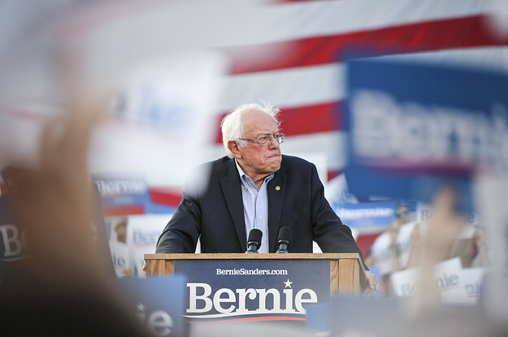

This Wednesday, April 8th, democratic nominee Bernie Sanders revealed that he would be dropping out of the 2020 presidential race. This leaves his remaining opponent, Joe Biden, as the likely Democratic nominee.

Sanders stated that he "cannot in good conscience continue to mount a campaign that cannot win and which would interfere with the important work required of all of us in this difficult hour," referring to the ongoing COVID-19 pandemic. He continued to reassure his supporters, stating "while this campaign is coming to an end, our movement is not."

Bernie Sanders ran on a progressive platform, bringing awareness to issues such as universal healthcare, minimum wage, and more. His opponent, Joe Biden, will likely continue onwards to directly face current President Donald Trump in the 2020 Presidential election. In a later issue, we will cover the key differences in Joe Biden and Donald Trump's election and reelection platforms.