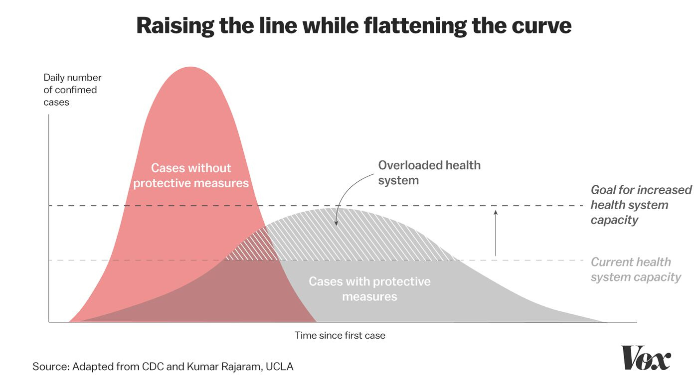
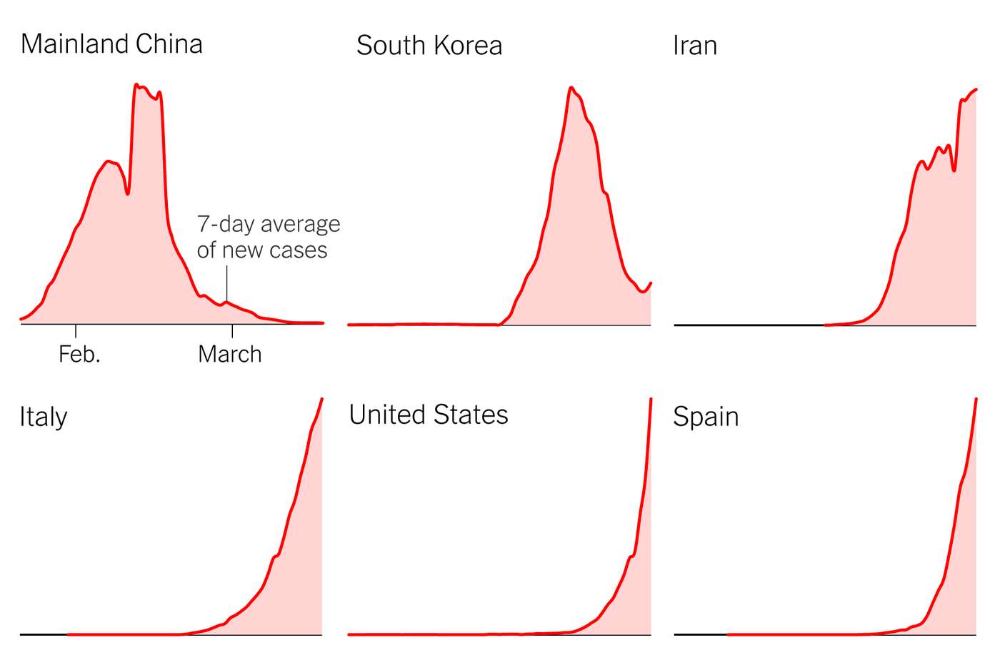

The biggest question in most people's minds right now is "we are being told to flatter the curve, but is it even working?" What may seem like a simple question, is actually a little harder to answer. 

First off, what is flattening the curve? Flattening the curve is the use of protective measures to reduce the number of cases of a disease at any given time. These protective measures include, but are not limited to, social distancing, proper hygiene practices, and more. The goal of flattening to curve is to make sure that hospitals aren't overrun with cases, which is often the case when large-scale pandemics like COVID-19 hit. 

So now that we know what flattening the curve is, is the U.S. actually doing it? We said earlier that this question is hard to answer, and here is why. Coronavirus deaths in the U.S. are currently rising rapidly, even with a large amount of the population being ordered to stay at home, and most jobs being made remote. However, we don't know what the current situation of the pandemic would have been if we didn't take these measures early on, meaning that it is hard to compare our curve to a "flattened" or "unflattened" one. Other counties have shown both more drastic or "squashed" curves, such as China and New Zealand, but both of those countries are very different from the U.S. in a number of ways. Positive results are being shown though, with many health officials urging people to continue practicing social distancing, as it's imperative in the coming weeks to do so. To summarize this, we can't know for sure whether we are flattening the curve or not, but we can definitely see how our protective measures are reducing the number of potential cases. Keep that in mind and remember to stay 6 feet apart from others, wash your hands, and try to wear a face mask if you leave the house!

