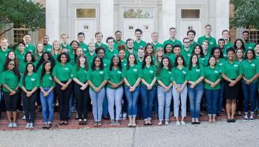

The Student Government Association (SGA) is an organization that grants funding to students for conferences, promotes student organization’s programs, and hosts campus-wide events. Seeing the disproportionate number of students that voted for the next TAMS Senator from April 6 - 9, we got the opportunity to interview Michael Luecke, Cameron Combs, and Navya Chintaman, to spread awareness about what the SGA does. 

As of April 10th, Michael Luecke and Cameron Combs are SGA’s president and vice president. They campaigned off of SOAR: Synergize, Outreach, Assure, and Redefine. “Synergy just means bringing different outlets, departments, [etc.] together—just making sure we’re working with them cohesively,” says Michael. Cameron says assurance is “making sure that our students are aware of the different things going on on campus as well as being a voice for them.”

When asked about what inspired them to run for their spots, Michael says he wanted all students to have a voice. It’s important to him that “all students are being represented on campus and having their voices heard.” They had been discussing this campaign since last summer but for Cameron, it had more to do with his role in UNT’s BSU (Black Student Union). “Some of our organizations are smaller minority organizations and they don’t always get the necessary resources they need to be successful,” he says. This ties into their other main goal: to redefine SGA by giving students the resources they need. 

Navya Chintaman was elected our TAMS senator on that same day, with a campaign based largely on mental health issues and openness with the TAMS community. Navya credited her decision to run to the previous senator, Reese Jacobs Neal, and how he “used his platform to inspire social change,” and hopes to make a similar impact during her time as senator. 

At the center of her platform are her mental health policies for TAMS students, with the hopes of providing a solution for all TAMS students. She wants to make it “easier to access professional help” and provide ways for even the more reserved students to get help, such as one-on-one checkups with RAs, without having to ask for it themselves. 

Navya’s other major campaign platform was one of openness and communication with the TAMS community. Her plan to provide more individualized course plans for the arts tracks came from this openness; it was something requested by the arts students themselves. She believes “the student senator is responsible for voicing [the students] concerns,” and to help them find suitable solutions. “I am always ready to listen,” says Navya, and urges students to come to her with any questions, comments, or concerns they may have. 

The Ballot Buzz had the opportunity to interview our new SGA president and vice president, which we have attached below!

*Shout:* **Give us a summary of what you plan to do in SGA.** 

*Michael:* We ran off a platform called SOAR. Pretty much, it was to synergize, outreach, assure, and redefine. So with that, we were planning to synergize the campus. “Synergy” just means bringing different outlets, departments, things like that together—just making sure we’re working with them cohesively. 

*Cameron:* “Synergy” is connecting with different departments and organizations, like other colleges ... our outreach is our “Foods To-Go” as well as our meal swipe plan; those are just two differnet initiatives under our outreach pillar. “Assure” is essentially what our student voice is, just making sure that our students are aware of the different things going on on campus as well as being a voice for them. For “Redefining,” we want to focus on refining the organizational aspects of SGA, making sure that students are getting what they need out of the organization with the resources that SGA has. 

*Shout:* **What inspired you two run for president and vice president for SGA?** 

*Michael:* I wanted to be able to speak for all students; I wanted to make sure all students were being represented on campus and that we were actually having our voices heard. Especially in decisions that are going to directly affect us as a student body, we need to make sure that we have student representation when those decisions are being made. 

*Cameron:* Myself and Michael, we had started talking about this last summer, so it’s been something that I’ve always thought about doing but more within my role with BSU (Black Student Union). Seeing how some of our organizations are minority organizations and smaller organizations and how they don’t always get the necessary resources they need to be successful on campus, that was my biggest thing.

We want to extend a big thank you to Michael, Cameron, and Navya for talking to out Shout! heads and making this interview a reality. If you have any questions about their campaigns, they are happy to answer any messages across all social media platforms.