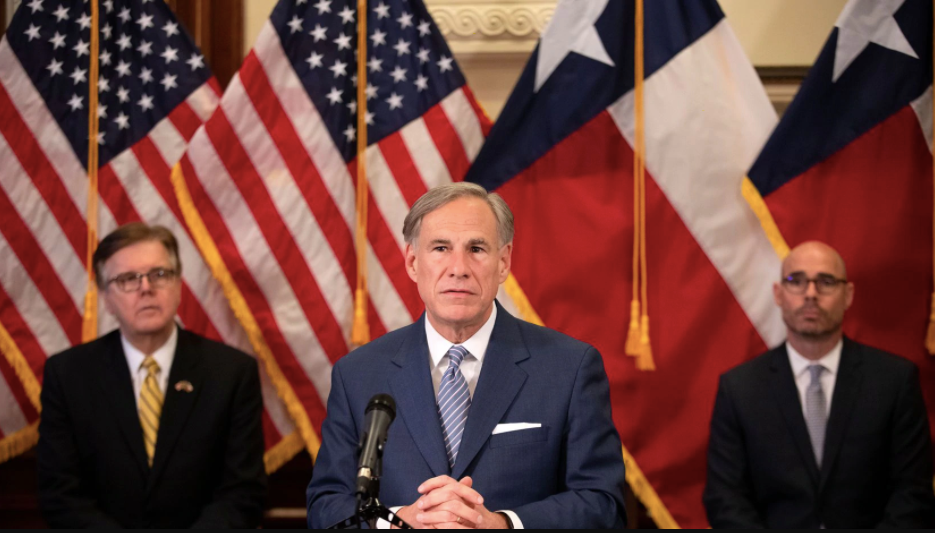

To reverse the negative impact the coronavirus outbreak has had on the U.S. economy, Donald Trump proposes a plan for reopening U.S. states to get economic activity back to normal. The reopening plan comes in three phases, the first one being opening restaurants, sporting venues, and gyms while still maintaining social distancing. The second phase, which is for states likely to have no rebound, schools can reopen and shopping malls can open to hold a maximum of 50 people. In the first two phases, people at high-risk for coronavirus are to stay at home, but the third phase, for states that show no evidence of rebound and have passed the reopening gating criteria three times, individuals at high-risk may resume public interactions while practicing social distancing. 

Governor Greg Abbott also recently revealed a rough plan to gradually reopen the Texas economy over the coming weeks and months. This started with state parks opening on last Monday, April 20, restrictions on medical procedures being loosened on Wednesday, April 22, and retail stores being opened for curbside pickup on Friday. These decisions were made in hopes of bringing some normalcy back to people’s lives, while still minimizing the spread of COVID-19. However, Abbott made it clear that any businesses that break the social distancing guidelines will have their operating licenses revoked. He has also faced criticism from both sides of the political spectrum about his plan, with some attacking it as putting corporations’ interests over public health, and others saying it does not go far enough to revitalize the economy. The state government will announce more information on April 27 and later in May if the infection rate stays low.