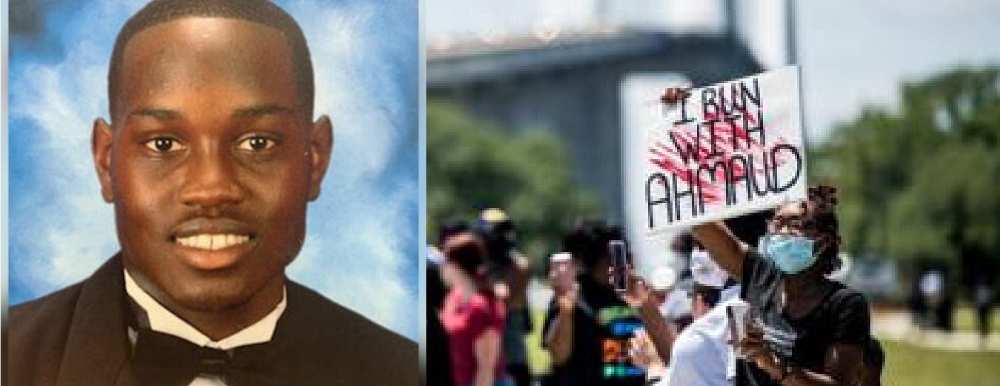

On February 23, Ahmaud Arbery was shot and killed while jogging down a neighborhood road. He was unarmed when Travis McMichael and his father Gregory McMichael, armed, left their pickup truck to confront Arbery. On May 5, a video of the shooting uploaded to YouTube went viral. To show support for Arbery and increase awareness about his death, the online #IRunWithAhmaud campaign was created and asked people to run 2.23 miles in honor of the date Arbery died. However, as more people became aware of the situation, the focus of the campaign expanded to address the core issues exposed by Arbery’s death. Due to the public pressure put on this case, Arbery’s killers were taken into custody on May 7 for murder and aggravated assault. 

Although his killers have been arrested, the legal battle is far from over. Many people are concerned about the possible conflicts of interest in the case, as the McMichaels are well connected in their community law enforcement and its leadership. Georgia is also one of only a few states without “hate crime laws”, which allow for harsher punishments for crimes deemed to have been motivated by a bias. But support for these laws has surged due to Arbery’s death, and has strong bipartisan support in the state legislature. Many people hope that this tragedy will bring a positive change in the way law enforcement handles cases of this nature and help to ensure equal treatment for all people regardless of race.