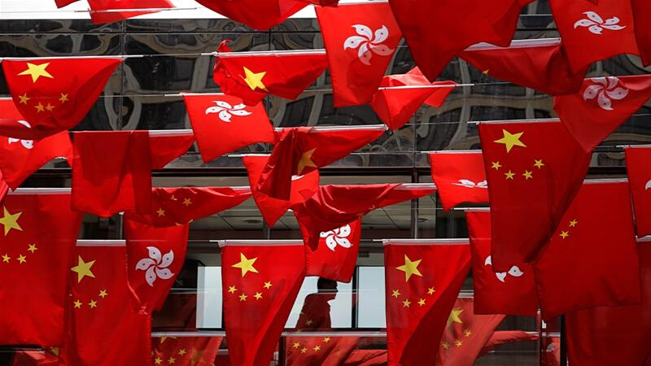

Hong Kong has had a very unique history when it comes to who controls the territory. Originally a part of mainland China, it was ceded to the British empire during the First Opium War, and remained under British control until 1997 when it was transferred back to China under the guarantee that Hong Kong would retain its political and economic freedom for at least 50 more years. But just a few years after, in 2003, the first major attempt to reduce Hong Kong’s autonomy was being pushed through the government. Mass protests helped block the passage of this anti-sedition law, which would prevent citizens from freely speaking out against the government, and future administrations avoided this law. 

That is, until last week. After over a year of constant protests against the proposed “extradition bill”, which would allow criminals to be transferred to the mainland for processing, the Chinese government is set to push an even more extreme anti-sedition law through the legislative council. It will criminalize “treason, secession, section (and) subversion” of the central government, as well as allow Chinese national security agencies to operate in Hong Kong. Like the 2003 bill, this would in theory give the central government the ability to retaliate against anyone who speaks against them, including activists and lawmakers, with the mainland utilizing a constitutional loophole to guarantee the bill results in a law being made.

Pro-democracy activists and lawmakers in Hong Kong, as well as over 200 political figures from around the world, have publicly denounced this law, saying they are a “comprehensive assault on the city’s autonomy, rule of law and fundamental freedoms," though the planned protests will be unable to have a direct impact on lawmakers due to the bill likely being passed without a vote. Although there does not seem to be much that can be done to stop this law from being passed, activists are calling on people to not give up hope. Nathan Law, a leader of the 2014 Umbrella Movement protests, reminded people of the situation in 2019: “At this time last year, didn't we all think the extradition law would definitely be passed? Hong Kong people can always create miracles.” It is still unclear what exactly the domestic aftermath of this law will be, but one thing is for sure: the fight for democracy in Hong Kong will not be over any time soon.