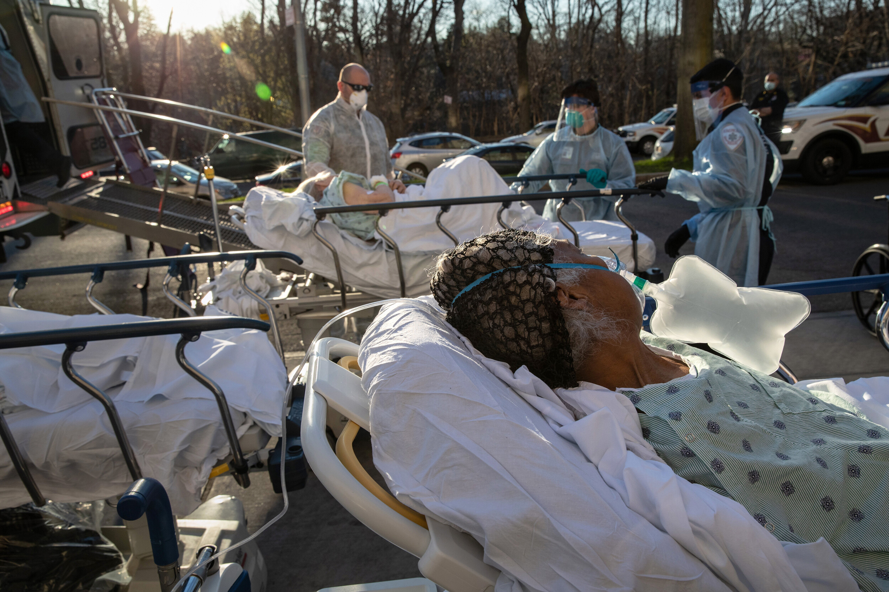

A month into the coronavirus outbreak, it was revealed that black Americans were getting the virus in disproportionate amounts in comparison to white Americans. Evidence showed that this was because black Americans tend to have more pre-existing health conditions, hold more essential jobs, and the racial disparities in housing that cause black Americans to live in more packed spaces led to a faster spread of the virus. But as more evidence points to black and Latino communities being hit harder by the virus, it was found that Texas doesn’t seem to be providing enough testing centers for these vulnerable communities.

For El Paso, Fort Worth, and Austin, when NPR found a connection between higher POC populations in areas and less testing centers than other areas. Not counting mobile testing sites and hospitals that only test admitted patients, only 9 of the 25 testing centers in Austin are in areas with a lower density of white people. Black and Latino communities in Dallas only get 9 testing centers, while the predominantly white North Texas gets 20, San Antonio and Houston were some of the few of the cities to initially consider risk factors and CDC testing data when distributing testing sites. 

But the cities in Texas are starting to take this information into account to aid their more at-risk communities. In Austin steps were taken to send healthcare workers to homes of people unable to reach testing centers. Research at UT determined that parts of South Dallas with a higher concentration of people with asthma, diabetes, and obesity—which happen to contain mostly minority neighborhoods—lack a sufficient amount of testing sites. Dr. Phillip Huang, the director of Dallas County Health and Human Services, says the county is trying to direct more testing resources to these neighborhoods.