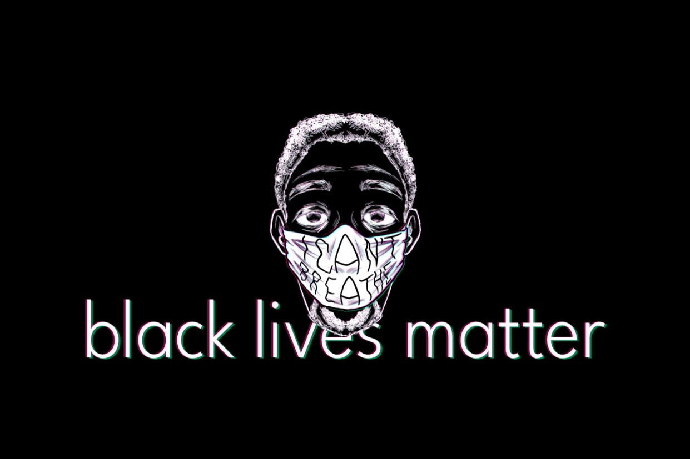

These past few weeks have brought to light the injustices black people face in our country every day. From Philando Castile to George Floyd, Sandra Bland to Breonna Taylor, the reach of police brutality has affected thousands. So many of us will never truly be able to understand how black people in America must feel every day, knowing that they could be killed for the color of their skin and nothing else. As phones and social media become the norm, it's much more common to see videos of law enforcement abusing their power, to the point that a large part of our generation is nearing desensitization to the very issue. It does leave one to wonder, however, how many people whose stories we don't hear. How many lives were changed, or even ended by a single interaction, but there was no phone or camera around to capture it. How many stories have been forgotten, didn't gain enough traction, or never received justice. How many? 

Growing up as a brown girl in America, I thought I had a good understanding of race. I believed that my own encounters with prejudice made it so that I had well rounded view of the topic overall, and while I acknowledged that black people had it so much worse than me, I rarely found myself taking the steps needed to bridge that gap and actively learn about the inequalities and differences all races experience. These past few years, however, have opened my eyes to how we must all take an active role to educate ourselves. And with that, we introduce the Black Lives Matter issue of the Ballot Buzz, and we hope it is informative, eye-opening, and challenges you to reflect on your implicit biases and work to dismantle them.

_Artwork by Carina Jiang_