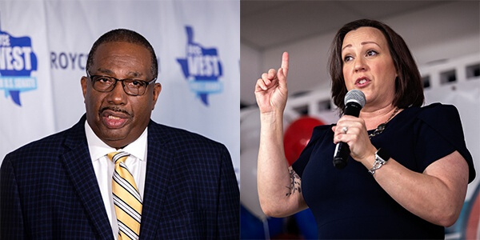

Although most of us can’t vote this year, that shouldn’t stop you from sharing information with your friends and family members who can vote. The last day to register to vote in the Texas primary runoff is June 15.

<b>Healthcare</b>
 

**Royce West:**
* In 2018, he introduced a bill to expand veterans’ eligibility for Medicaid.
* Wants to fund Obamacare further.
* He’s written bills to include mental health services in schools and to make mental health a part of their curriculums.

**Mary Hegar:**
* Every child should be covered.
* Medicare-like military-provided Tricare should be provided for all Americans.
* Will advocate for lowering the cost of prescription drugs.
* Will oppose any age-tax from insurance companies.

<b>Higher Education</b>
 

**Royce West:**
* Implement debt relief programs for former students and offer free tuition to community colleges for low-income students
* Sponsored a bill to create the UNT School of Law in Dallas.

**Mary Hegar:**
* Student loans should have a grace period where the loan doesn’t accumulate interest.
* Encourage support and investment in vocational programs.

<b>Immigration</b>
 

**Royce West:**
* Wants to provide more resources at the border such as judges for asylum seekers.
* Work with Central America and Mexico to prevent their citizens from feeling the need to flee their homes.
* Stop children from being put into cages and invest in keeping the border secure.

**Mary Hegar:**
* End child separation and ensure asylum seekers aren’t treated like criminals.
* Invest in technologies to secure the border rather than with a wall.
* Will stand against political leaders who use white-nationalist rhetoric, especially in reference to immigration. 

<b>Economy and Jobs</b>
 

**Royce West:**
* Supports a $15 minimum wage and has fought to raise the minimum wage in Texas.
* Believes in making banking accessible for low-income families.

**Mary Hegar:**
* Fight against cutting pensions, Social Security, and Medicare.
* Would vote against any legislation that only benefits big corporations.

<b>Environment</b>
 

**Royce West:**
* Investing in clean energy solutions so we stop relying on fossil fuels.
* Promote solar and wind industries to create more jobs and improve the environment.

**Mary Hegar:**
* Invest in clean energy and sustainable transportation.
* Modernize the energy grid to account for peak usage.
* Believes Texas should use its renewable resources to create more jobs.

<b>Criminal Justice</b>
 

**Royce West:**
* Pass federal legislation to end private for-profit prisons, get rid of mandatory minimum sentences, promote rehabilitation centers, and support former inmates.
* Promote de-escalation methods in police departments. Has sponsored legislation for body and dashboard cameras for police.

**Mary Hegar:**
* End for-profit prisons.
* End racial and economic disparities in the criminal justice system such as the stop-and-frisk law and incentives for unfair arrests.
* In support of Campaign Zero’s reform policies.

<b>LGBTQ+ Rights</b>
 

**Royce West:**
* In favor of the Equality Act and ending Trump’s transphobic policies like the ban on transgender citizens joining the military.

**Mary Hegar:**
* Supports the Equality Act.
* Ban conversion therapy and reverse the ban on transgender citizens from joining the military.
* Will work to bring in more LGBTQ+ voices to the political process.