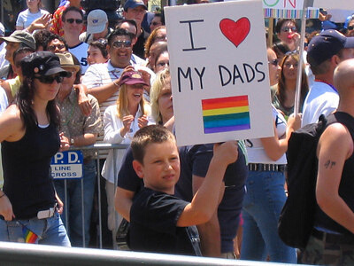

As functional units of our growing society, family can mean a lot of things--and it doesn’t always look like mom and dad. For many LGBTQ+ couples, starting a family can be a challenging hurdle of the next important step in a relationship. Earlier this month, the Trump Administration filed a brief with the Supreme Court arguing that cities should not be held responsible for the protection of LGBTQ+ couples from facing discrimination from taxpayer funded social service agencies if it violates the organization’s religious beliefs. The case began when the City of Philadelphia hired Catholic Social Services to provide foster care services, but the agency refused to match children with same-sex parents. The organization violated the terms of a contract signed with the city, so the City of Philadelphia terminated the contract--CSS sued in return. The CSS claimed first amendment rights, stating that they are free to exercise the freedom of speech and religion; the district court ruled against CSS, and the decision was unanimously upheld by the 3rd US Circuit Court of Appeals--the case is now pending before the Supreme Court. According to the Census Bureau, same-sex couples are six times more likely to foster children and four times more likely to adopt in comparison to their non LBGTQ+ counterparts. On June 26, 2015, The Supreme Court legalized same-sex marriage, but there needs to be more change moving forward. There are no federal nondiscrimination laws in place to protect members of the LGBTQ+ community, many states do not have protection in place for LGBTQ+ parents, and there have been spikes in hate crimes against the LGBTQ+ community. Begin advocating for nondiscrimatory laws by signing petitions and educating yourself on current events.