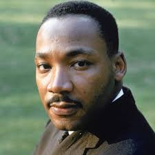
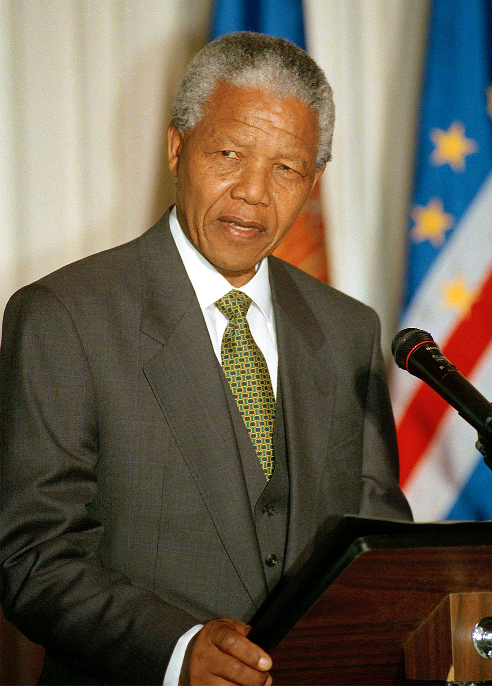
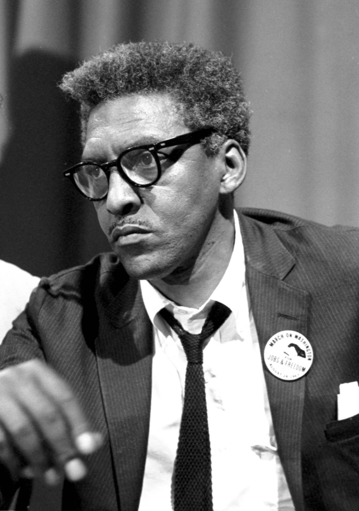
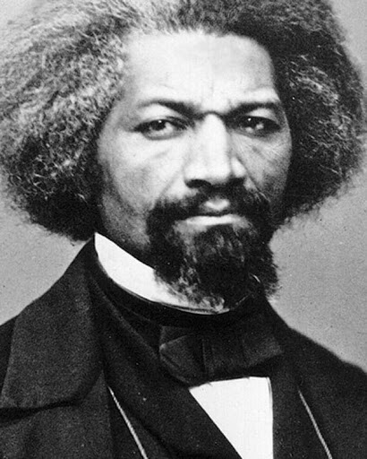

In honor of Father’s Day, we decided to look back in time at the “fathers” who inspired the many great movements that brought equality. Although they themselves may not have children, the work they did birthed opportunities to many. Today, on Father’s Day, we want to celebrate the fathers of our society. Through their hardships and accomplishments, these trailblazers and their movements are in essence, very similar to a father and his child.

<b>Martin Luther King Jr.</b>

<i>“A riot is the language of the unheard.”“Injustice anywhere is a threat to justice everywhere.”“The time is always right to do what is right.”</i>
 

Martin Luther King Jr. is one of the most celebrated people in our history. He was an American minister and activist who became the face and spokesperson of the Civil Rights movement from 1955 onwards. He was mainly known for organizing nonviolent protests for freedom and equality between the Black and White(and other races as well) populations of the United States. King is especially famous for his speech “I Have a Dream.” King continued to strongly lead the Civil Rights movement until his assassination in 1968.

<b>Nelson Mandela</b>

<i>"Education is the most powerful weapon which you can use to change the world."Sometimes, it falls upon a generation to be great. You can be that great generation. Let your greatness blossom.""For to be free is not merely to cast off one's chains, but to live in a way that respects and enhances the freedom of others."</i>
 

Mandela is a well-known South African activist and philanthropist. He served as President of South Africa from 1994 to 1999. He was elected president in a fully representative democratic election, making him the first black head of state in South Africa. He’s mainly known for being an anti-apartheid activist and revolutionary- he fought for the many who were disadvantaged by the South African system of racial segregation. Mandela additionally played a pivotal role in negotiating the freedom and equality of all South Africans- regardless of their skin color and race.

<b>Bayard Rustin</b>

<i>"When an individual is protesting society's refusal to acknowledge his dignity as a human being, his very act of protest confers dignity on him.""To be afraid is to behave as if the truth were not true.""We need, in every community, a group of angelic troublemakers."</i>
 

Rustin was an American civil rights organizer and activist, famous for working with A. Phillip Randolph on the 1941 March on Washington movement for an end to racial discrimination in employment and working as an advisor to Martin Luther King Jr. in the 1950s and 60s. He additionally was a leader in the movements for nonviolence, socialism, and gay rights. Rustin was additionally gay himself, both leading and strategizing the movements against
discrimination based on race and sexuality.

<b>Frederick Douglass</b>

<i>"Power concedes nothing without a demand. It never did and it never will.”“If there is no struggle, there is no progress.”“Those who profess to favor freedom, and yet depreciate agitation, are men who want crops without plowing up the ground.”</i>
 

Born in 1818, Separated as an infant from his slave mother, Frederick lived with his grandmother on a Maryland plantation until he was eight years old. Defying a ban on teaching slaves to read and write, Baltimore slaveholder Hugh Auld’s wife Sophia taught Douglass the alphabet when he was around 12. Through his literacy, Douglass began to read newspapers, political writings, and literature. Through this, his ideological opposition to slavery began to take shape. As an antislavery lecturer, Douglass was asked to tell his story at abolitionist meetings. During this time, he published his first autobiography.

In order to evade recapture, He sailed to Liverpool, and eventually ended up in Ireland. He remained in Ireland and Britain for two years, speaking to large crowds on the evils of slavery. During this time, Douglass’ British supporters gathered funds to purchase his legal freedom. In 1847, Douglass was freed and returned to America.

Upon his return, Douglass produced the abolitionist newspapers: The North Star, Frederick Douglass Weekly, Frederick Douglass' Paper, Douglass' Monthly and New National Era. The motto of The North Star was "Right is of no Sex – Truth is of no Color – God is the Father of us all, and we are all brethren."