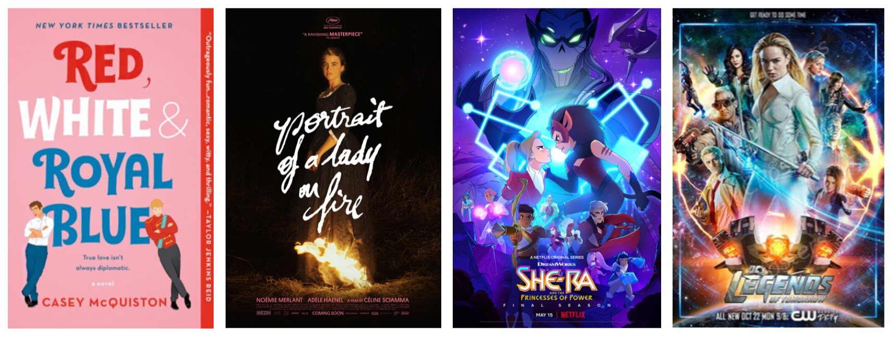

Even though LGBT characters are still woefully underrepresented in the media, strides have been made for their representation. Below is a list of media over multiple genres, so there’s something for everyone: 

If you like realistic fiction:
* The Art of Starving by Sam J. Miller
* Darius is the Great is Not Okay by by Adib Khorram
* The Perks of Being a Wallflower by Stephen Chbosky
* Simon vs. the Homo Sapiens Agenda by Becky Albertalli
* We Are Okay by Nina LaCour
* Check, Please! by Ngozi Ukazu (webcomic)
* **Red, White, & Royal Blue by Casey McQuiston**
* Felix Ever After by Kacen Callender
* I Wish You All the Best by Mason Deaver

If you like historical fiction:
* The Gentleman's Guide to Vice and Virtue by Mackenzi Lee
* The Song of Achilles by Madeline Miller
* Giovanni’s Room by James Baldwin
* Maurice
* The Favourite
* **Portrait of a Lady on Fire**
* Kill your Darlings (not fiction, just a dramatic retelling)

If you like fantasy:
* **She-Ra and the Princesses of Power**
* Carry On by Rainbow Rowell
* The Last Sun by K.D. Edwards
* The Fascinators by Andrew Eliopulos
* The Croaking by echorise on Webtoon
* The Magnus Archives
* The Two Princes

If you like science fiction:
* An Absolutely Remarkable Thing by Hank Green
* We Are the Ants by Shaun David Hutchinson
* Always Human by Ari North (walkingnorth on Webtoon)
* Roswell: New Mexico
* **DC's Legends of Tomorrow**

The LGBTQ+ community has come a long way in terms of representation, but there is still a long way to go. Issues like queerbaiting and fetishization of queerness continue to run rampant in our media. Being present in the media is a huge step forward, but it is not enough.

(<b>bolded</b> are the editor's picks)

