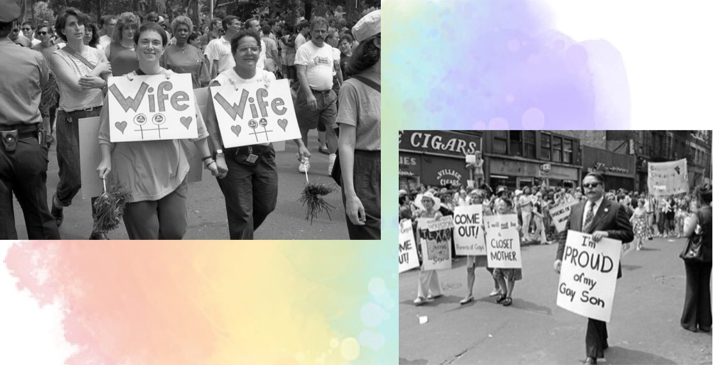

With rainbows streaming onto company merch lines and social media feeds, it’s easy to forget that Pride isn’t just about the presentation. There’s an entire history to the community that is often overlooked, and to remember our roots is to keep the memory of those who came before and fought for us.

In multiple ancient civilizations, homosexuality and transgender identities were respected, such as the *motsoalle* relationships in Lesotho, the male partners of Chinese and Japanese emperors, and the hijra in South Asia. Following the High Middle Ages in Europe, however, authoritative persecutions against homosexuality peaked, especially during the Renaissance under the Roman Catholic Church, where homosexual activity in many European states went from legal to punishable by death. By the mid-20th century, homosexuality was considered a societal failure in Western psychology, and in the US especially, in the 1930s, anti-gay laws were passed nationwide, and homosexuality was declared a mental illness, with treatments including castration, lobotomies, and electroshock.

The 1960s in the US were a turning point in LGBT liberation. A number of pro-LGBT demonstrations preceded the Stonewall Riots, 1969, where a five-day riot ensued after police raided the Stonewall Inn. Parades were organized nationwide, and by the late 1970s, mainstream society was tolerant of the lesbian-gay subculture. The most wellknown example being Harvey Milk, the first openly-gay man elected official in California, and the formation of gaystraight/gender-sexuality alliances (GSAs) in schools. However, the AIDS Epidemic of the 1980s crippled the LG community nationwide, as the fatal disease was often connected to men who had sex with other men, and the initial belief that HIV could only affect gay men led to an entire lost generation of LGBT individuals.

In 2001, the Netherlands became the first country to legalize same-sex marriage, followed by many others. In 2003, the US decriminalized homosexual sex (sodomy) nationwide in Lawrence v. Texas, and on June 26, 2015, same-sex marriage was legalized nationwide in the US.

These roots act as an important reminder of the oppression brought upon the LGBTQ community for a long time. Pride gives a larger platform for the community to continue its fight for equality, especially in places that criminalize the community. The most important takeaway from this history is that the modern LGBTQ movement that gave way to Pride is built on recognizing and uplifting each individual's own worth.

