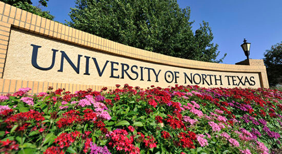
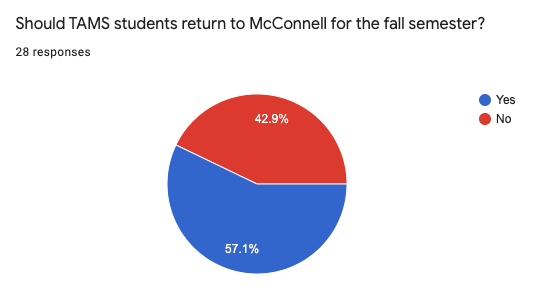

As universities create plans for reopening in the Fall, many students have been both voicing concerns about returning and advocating for on-campus learning as well. Administrators are needing to consider both the quality of education available as well as the safety of everyone on campus, whether students, educators, or staff. Many TAMS students consider McConnell Hall, where students of all years live, to be as integral to the TAMS experience as the classes, if not more. This puts TAMS Administration in a unique situation to keep their students, most of which underage, safe, but also continue the experience. Ballot conducted a survey of current TAMSters where we asked how they felt about returning to McConnell, and received these responses:

Ballot also asked for TAMSters' opinions on returning to McConnell Hall, and received these responses:

* "No - Right now, I think that the recent surge in cases in Texas makes it virtually impossible to return to UNT in the fall without putting every student and their family at risk. I just think it’s too early to reopen."
* "No - Even if we move in, interactions will so limited that it'll be so annoying. Moreover, most of our classes are already online, so I don't see a point in moving in. I can understand a majority of Juniors wanting to move in because when they applied, they were looking forward to the TAMS experience, but as someone who lived it for a year, I can confidently say that the experience will be ruined by the restrictions provided with in residence education such as only two people per room. Online would not only ensure our safety, but reduce tuition. In terms of club activities, we are TAMSters; we can get creative with the opportunities we provide to students from home."
* "No - All of our classes are online anyway. We’re essentially paying room and board for nothing. I believe that the spirit of TAMS can continue outside of McConnell, and in a practical, economic, and public health sense, returning to TAMS is a very unwise decision."
* "Yes - Although I agree that we should return to McConnell for the fall semester, we cannot and should not expect a similar experience of McConnell like... the 2019-2020 school year. Despite the enhanced restrictions this fall... I believe that the TAMS environment can still flourish if we are all there... I personally struggled to maintain the same level of rigor and academic drive when we were in the online format for the latter half of the spring semester, and I am not the only one that felt this way. Coming back together would foster and environment of support and determination that is so integral to the TAMS experience. However, I do not think it would be responsible for the administration to try to make things as "normal" as possible. I believe that in order for moving back to be truly worth it, the administration must commit to more invested academic and mental health counseling. This not only includes more help and guidance from advisors, administrators, and counselors, but it also includes being more understanding in general. TAMS policy (excluding the absolutely necessary implementation of health practices) can seem to be somewhat harsh and unapologetic at times, so a commitment to promoting an environment of growth and development as opposed to one of rules and restrictions would be more beneficial for the student body. Additionally, I believe TAMS (including administration, student life, and even the clubs) needs to make a thorough effort to supporting our community, both internally and externally, during this COVID-19 crisis. This means instead of promoting an environment that solely focuses on research and academics, promote an environment of researching ways to help resolve this crisis... and actively encouraging activities and events that support affected communities during these times. Moreover, the administration needs to take a serious look into the significantly increased danger of closed weekends. It would likely be a safer alternative to not mandate closed weekends in order to prevent students dispersing all across the state and then coming right back into a more concentrated environment under the roof. The continuation of this practice would not only endanger the general health of the student body, but it could very easily endanger the health of our family members. At the end of the day, the TAMS community is stronger together, and we can all play a better role in helping solve this mess together if we are all physically at McConnell Hall in the fall."