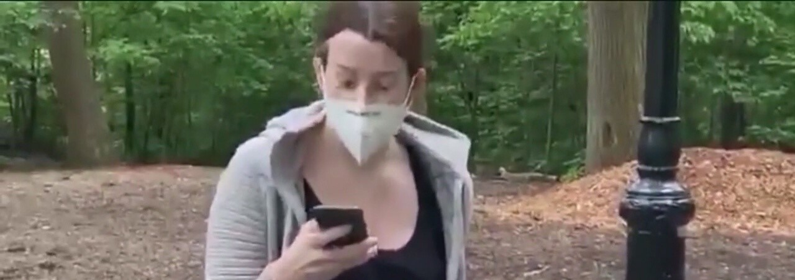

On April 29, 2018, a black family was grilling some meat at a designated grilling zone in Oakland, California. A white woman by the name of Jennifer Schulte saw them barbecuing and thought the best course of action would be to make multiple emergency calls.Whilst on one of these calls, Schulte claimed that “it’s illegal to have a charcoal grill in the park,” which it isn’t. It seemed as if her biggest concern was the fact that the grill was a charcoal grill which was a problem, as she believed the park only allowed non-charcoal grills.

Later in May, Lolade Siyonbola, a black student at Yale University, was interrogated by campus police for sleeping in a common room in her dorm. She claims a white student had entered the room Siyonbola was in, saw her, and said “you’re not supposed to be sleeping here. I’m going to call the police.”

During June in Cleveland, Ohio, a few black kids between the ages of 8 and 12 were tasked with mowing a friend’s lawn. The children accidentally mowed a small portion of that friend’s white neighbors’ lawn and consequently, the cops were called. The caller, Linder Krakora, said “we called the police to ask the woman to have the kids stop mowing on our property.”

These incidents and many more—a 14-year-old black teen arrested for selling water bottles, 2 black men arrested for sitting in a Starbucks, a white women calling the cops on a black man who told her to put a leash on the dog she was walking—all have the common theme of white women racially profiling black people doing innocuous things.

The woman distraught over the barbecue was called BBQ Becky, the victim of accidental lawn mowing was dubbed Lawnmower Linda, and another white woman who called the cops on an 8-year-old black girl selling water was named Permit Patty, and for the past few years, social media has identified these types of people as “Karens.”

In response to protests brought about this year against police brutality, there’s been a surge of these Karens on social media, one who particularly called the police on a Filipino resident for writing “Black lives Matter” on his own property. The CAREN (Caution Against Racially Exploitative Non-Emergencies) Act in San Francisco would make contacting the police on the basis of someone’s race, ethnicity, gender identity, sexual orientation, or religion illegal. This ordinance, proposed by San Francisco Supervisor Shamann Walton, would classify these unnecessary police calls as hate crimes and the callers could be sued for up to $10,000. California law already makes filing false police reports illegal, but Walton aims to take this a step further by addressing discriminatory 911 calls. Oakland’s California Assemblyman representative, Rob Bonta, has brought a similar legislation to the statehouse. Walton says this course of action and similar bill proposals in New York and Oregon are part of “a larger nationwide movement” to account for racial biases and to penalize those who exploit emergency services with malicious racist intent.