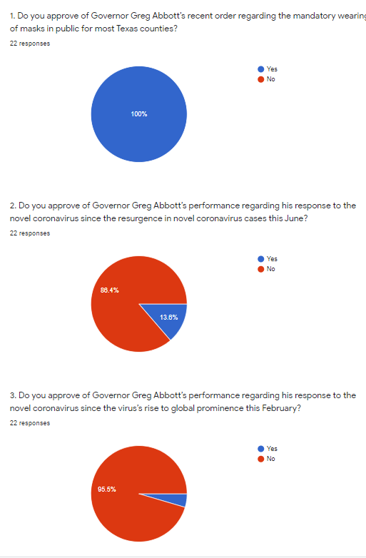

First of all, I started polling Ballot students earlier this week regarding Governor Greg Abbott’s coronavirus performance. I started polling last week. Here are the results of that poll:

Although Ballot students appreciated the measure taken by Governor Abbott to mandate the donning of masks in public spaces, many say it’s too little too late. Here are some quote from Ballot students:

* “The mask order only came as cases were already rising after the mass reopening of Texas. Mask orders are barely being enforced, and much too late overall. They should have been in place since the beginning.”
* “About the ‘mandatory’ mask order: It is good in theory, but county sheriffs are just flat out saying they won't enforce the rule. This completely invalidates the point of the mandate in the first place if people are not actually required to wear a mask in many places. I am not sure what Abbott can do about this, but it doesn't seem that he has even tried to properly enforce the rule.”
* “Governor Greg Abbott failed miserably in his position that was meant to protect Texans. Instead of looking to professionals (doctors, healthcare workers, CDC recommendations), he followed his own beliefs, and we paid the price for his shortcomings.”

The Ballot community has been very critical of Governor Abbott’s coronavirus response performance, to say the least. Moreover, Abbott’s approval rating plunged to 44 percent- the fifth lowest in the nation [Houston Chronicle]. However, the dip in ratings may not be for the same reasons as what the TAMS community has.

As mentioned in a response earlier, many counties are opting out of, or outright refusing, to enforce this mask policy. According to the Texas Tribune, nearly eighty counties have opted out of enforcing the mask policy (the Governor has created an exit path for rural counties), and sheriffs are refusing to prosecute violators of this policy. Additionally, there have been hundreds of protestors and many court cases in Texas counties citing an unconstitutional overreach of power by the Texan government [Fox]. It is obvious that Texas has been torn apart by not only the mask order, but the core values different groups through which Texas should be run. People often cite the too-little, too-late approach to the mask order, although many others say that the mask order has already overstepped boundaries. What has been made clear on both sides, however, is that the Governor’s approval ratings have sank, and with a Democrat PAC promising to defeat Abbott in 2022, perhaps this marks the end of Abbott in Texas.