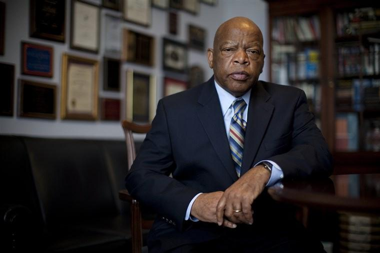

As one of the keynote speakers at the infamous March on Washington in 1963, John Lewis led the country’s civil rights movement at age 23. Lewis was the last alive member of the “Big Six.” Last week at age 80, Lewis died after being diagnosed of pancreatic cancer six months ago.

A recipient of the Presidential Medal of Freedom, Lewis guided the fight for equality and was at the forefront of the Civil Rights Movement. In 1965, Lewis led hundreds of peaceful protestors in Alabama which resulted in brutality by authorities. Known as “Bloody Sunday,” this day was critical in understanding the racism in the South and led to structural change. Lewis was the face of student activism during the 1960s leading the Student Nonviolent Coordinating Committee.

After paving the way for Civil Rights Legislation, Lewis took to civics, representing Georgia’s fifth district as a member of the U.S. House of Representatives. Lewis served on Capitol Hill for a striking 34 years. During his last weeks alive, Lewis visited police brutality protests and watched the fight for racial equality continue.

Though there is still work left to do, Lewis pioneered the movement that continues to inspire the fight today. President Obama writes “Not many of us get to live to see our own legacy play out in such a
meaningful, remarkable way. John Lewis did.”