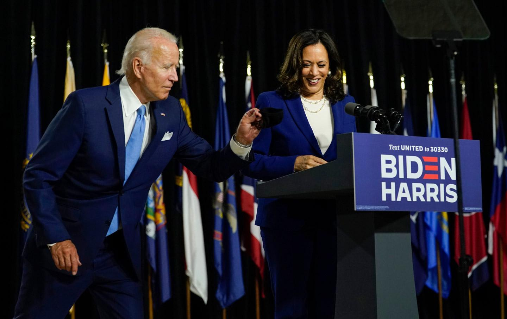

Presumptive Democratic nominee Joe Biden selected Sen. Kamala Harris as his vice-president on Tuesday. Harris ran for president last year but suspended her campaign in December. Voters in the democratic party took the news differently. While most are happy that Harris is the first woman of color on a major party’s ticket and potentially the first female vice-president, others are wary of her record in criminal justice. Some criticize her history as California’s Attorney General as some of her initiatives have led to increased incarceration of low level crimes. As democrats push for less policing, Harris might not have been the most strategic pick for Biden. Since this announcement, “birthers” have begun to question Harris’ birth country, though she was born in Oakland, California; these attacks heavily resemble that of former Pres. Barack Obama. Harris’ father is Jamiacan and her mother is an Indian immigrant. However, Biden’s decision didn’t surprise many. Earlier this year, Biden stated he would be selecting a female vice-president and Harris’ views reflect Biden’s closely. Though she has endorsed several far left-wing laws, she remains close to the establishment, something many Democrats scrutinize. During the first Democratic Presidential Debate, Harris called out Biden for working with rightwing politicians to stop the integration of schools. This attack could have led to Biden’s polling numbers’ decrease in the upcoming weeks. Harris’ skills on the debate stage are often deemed as exceptional and could be the reason she was added to the ticket despite this incident. While Harris opposed Biden at the beginning, she endorsed his campaign in March. While Democrats are divided on Harris, most will still vote for Biden as he leads Pres. Donald Trump NPR’s latest poll 53% to 42%.