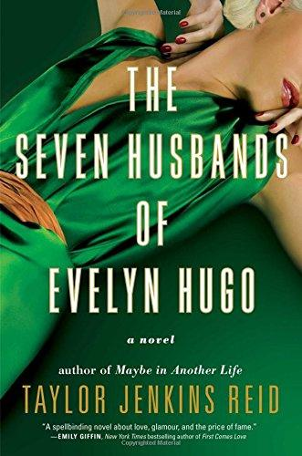

Stuck in quarantine, I've definitely found myself with more free time than I could handle at some points. To challenge myself this past month, and also start preparing myself for the heavy reading that accompanies the start of the academic year, I created a list of books that I wanted to read, with the goal of reading one a week. Most of these books look like they would never be found on a list together, ranging from period dramas, sappy teen romances, and retellings of historic events, but through my reading so far I have found myself enjoying every one on the list. My favorite so far has to be 'The Seven Husbands of Evelyn Hugo', by Taylor Jenkins Reid.

This is one of those books that I've had people recommend to me for years but never got around to reading until recently, but it now is one of my favorite books I've read. It follows the story of a journalist, Monique Grant who is called by to listen to and write the life story of the incredibly famous, yet elusive, Evelyn Hugo, a movie star of the 50s famously known for her 7 husbands. There are two big questions asked throughout the story - "Who was the person Evelyn loved the most throughout her life?" and "Why did Evelyn choose Monique, a basically unknown journalist, to write her story?" Both of these questions, resolved at the end of the book, had such unexpected answers that I was tempted to go back and reread the story, though nothing beats the experience of learning it for the first time. 'The Seven Husbands of Evelyn Hugo' is filled with mysteries, love (with LGBTQ+ representation), and completely unexpected twists and turns that resemble the unpredictable nature of life itself.