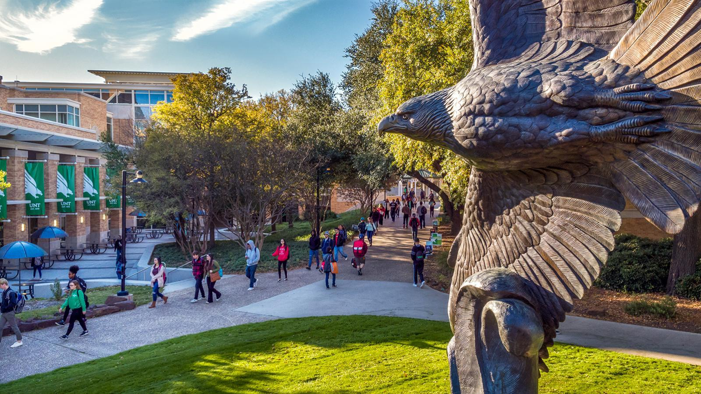

During last week’s Democratic National Convention, Joe Biden accepted the Democratic nomination for President of the United States. His running mate, Kamala Harris, accepted the Vice Presidential nomination. Due to COVID-19, the convention was mostly virtual. Speakers either used technology to speak from home, or pre-recorded their messages.

Prominent Democrats made the case for Joe Biden, including former President Bill Clinton, Hillary Clinton, Chuck Schumer, and Nancy Pelosi. Many of Joe Biden and Kamala Harris’s primary opponents also expressed their support, including Amy Klobuchar, Elizabeth Warren, Cory Booker, Pete Buttigieg, Andrew Yang, and Michael Bloomberg. Notably, Bernie Sanders, the more progressive runner-up, urged his supporters to vote for Biden.

The convention also featured Republicans, as the Democratic party hopes to appeal to those who voted for Donald Trump in 2016 but are disappointed with his leadership. Former Governor of Ohio John Kasich spoke, as well as former Secretary of State Colin Powell.

Former President Barack Obama gave sharp criticism of President Trump. “For close to four years now, [Donald Trump has] shown no interest in putting in the work; no interest in finding common ground; no interest in using the awesome power of his office to help anyone but himself and his friends; no interest in treating the presidency as anything but one more reality show that he can use to get the attention he craves. Donald Trump hasn't grown into the job because he can't,” Obama said.

The overall message of the convention was one of inclusion, unity, and diversity, with much focus on representing women, immigrants, and people of color. During Joe Biden’s acceptance speech, he assured Americans that his administration would be true to those values. “Here and now, I give you my word: If you entrust me with the presidency, I will draw on the best of us, not the worst. I will be an ally of the light, not of the darkness.”