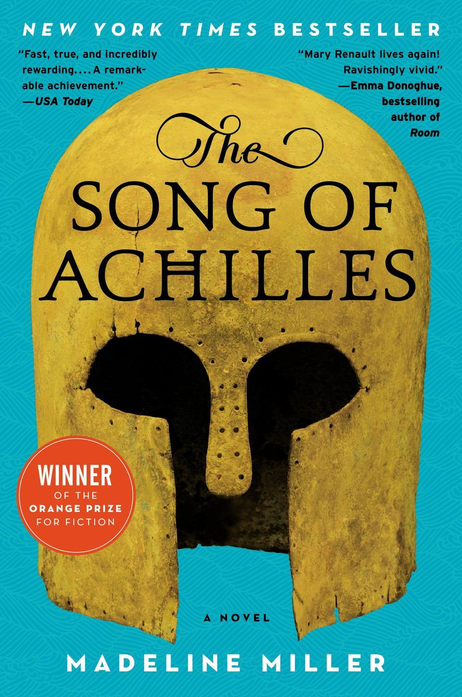

This has been a book I've always wanted to read-both because of my love of Greek mythology and the sheer number of people who have recommended this book. As was the case for many people, quarantine finally gave me an opportunity to work on my reading list. I read this book a few months ago, but it still remains one of my favorites.

The Song of Achilles is a modern retelling of The Iliad that focuses solely on one of the central relationships of the story: Patroclus and Achilles. Throughout the book, we see them grow from boys to men to soldiers. Achilles, with all his athletic prowess, has a prophecy to fulfill and Patroclus is just along for the ride. Throughout the book, we see how deep Achilles and Patroclus’ bond is because their relationship was truly the driving point of The Iliad. I won’t say anything else about the plot because I don’t want to spoil it (even though I’m not sure if I can spoil the Iliad). In addition to a dynamic cast of characters and an amazingly detailed look at The Trojan War, this book also has some of the best writing I’ve read in a long time. The story is told in a lyrical style, in the perspective of Patroclus as he lives through one of the most devastating love stories of history.