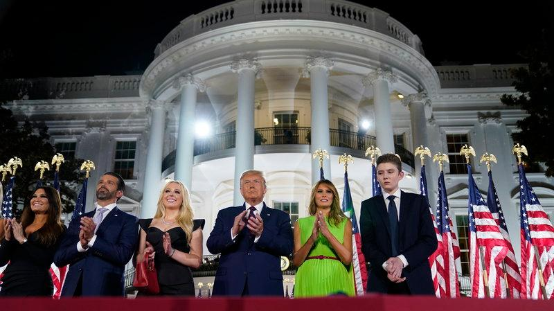

Over the last week, the Republican Party had their 4-day national convention to announce their Presidential nomination (President Donald Trump), solidify their base for this upcoming election and set up their party’s platform in order to garner undecided voters. One of the stark differences between the Democractic Convention and the RNC was that the DNC was streamed from different locations rarely causing contact between speakers, while the RNC was mostly streamed from one location with little social distancing.

On the first night, Kimberly Guilfoyle, a former FOX News personality, was trending on social media for her expressive and loudspeech; she faced criticism for screaming “the best is yet to come.” On the second day, first lady Melania Trump’s speech was clearly targeted at achieving the women’s vote this November. She stated that her husband has had “tremendous respect” for women and discussed how her husband has taken measures to support women globally. 

Then, President Trump accepted his nomination as the Republican candidate focusing on the issues of cancel culture, “squashing the socialist agenda,” and restoring “law and order”. Trump’s campaign has received $76 million during the RNC while Democratic nominee Joe Biden received $70 million.

In a GOP convention in Charlotte, 4 people tested positive for COVID-19 on Monday. On the later days of the convention, it was moved to Washington D.C. Overall, the convention faced mass criticism for the amount of Trump family speakers and for allegations of putting people to be in RNC ads without their consent.

Some Republicans are also unhappy with the convention, Chris Wallace, a FOX news host, said Trump’s speech was “ far too long” and “surprisingly flat.” Still, 9.2 million Americans tuned into FOX News to watch Trump accept his nomination for president with 2.2 million in the age 25-34 category, an unexpected leaning.