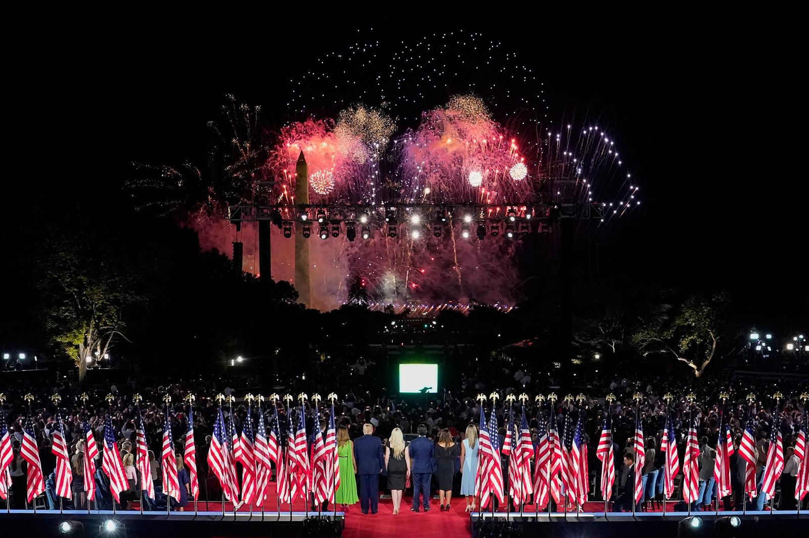

* Senator Tom Scott spoke about President Trump’s policies and why America needs them right now over former Vice President Biden’s policies.
* Kimberly Guilfoyle portrayed Trump as a leader fighting against the elites.
* Former ambassador Nikki Haley praised Trump’s foreign policy.
* Democratic politicians, including Georgia state Representative Vernon Jones and New Jersey congressman Jeff Van Drew (now a Republican), gave insight on why they are backing Trump.
* First Lady Melania Trump touched on the coronavirus death toll and the racial justice protests.
* Secretary of State Mike Pompeo highlighted Trump’s dealings with China and North Korea.
* Vice President Mike Pence defended the administrations coronavirus response, attacked Biden of wanting America to go on a path of “socialism and decline."
* Kellyanne Conway praised Trump’s support of women in leadership roles.
* Iowa Senator Joni Ernst spoke about Trump’s support for farmers through his trade deals and policies.
* Housing and Urban Development secretary Ben Carson portrayed Trump as the freedom candidate and highlighted his support for historically Black colleges and universities.
* White House aide Ja’Ron Smith talked about Trump’s “deep empathy” for Black Americans after the recent police killings.
* Rudy Giuliani claimed Biden will bring “lawlessness to your city, to your town, to your suburb” if elected.
* Ivanka Trump says “Washington has not changed Donald Trump.
* Donald Trump has changed Washington.” Trump accepts the GOP nomination and gives a contrast between the “bright future” of Trump’s America and a “disastrous” and “catastrophic” Biden administration.

