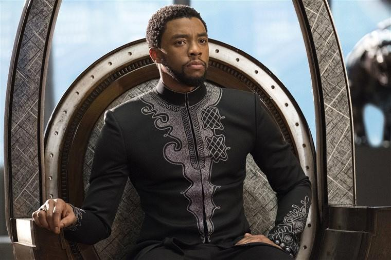
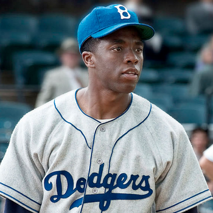
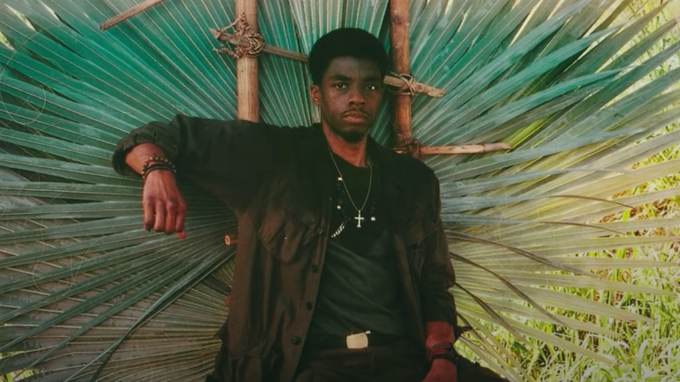
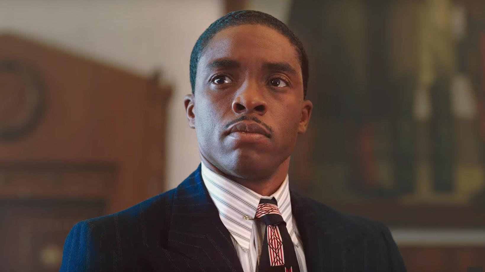
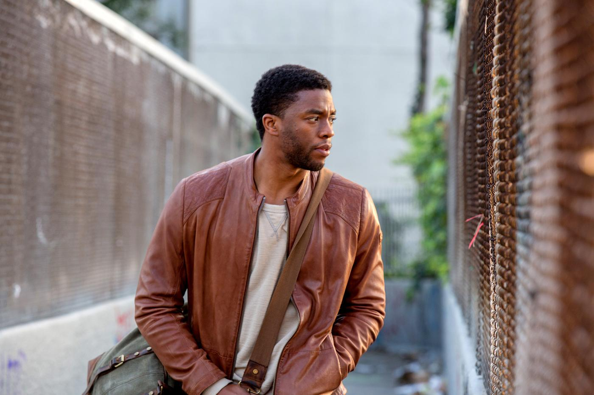

After learning of the recent death of Chadwick Boseman, many of us feel the need to look back at the actor's greatest performances. It's incredibly hard to process the death of people who are an important part of our life, but the way to make sure their legacy lives on is through the things they were passionate about and, for Boseman, those were many of his movies. For a special version of the Ballot Recommendation series, we have compiled a list of our favorite movies Chadwick Boseman took part in.

* **Da 5 Bloods**
* 21 Bridges
* **Marshall**
* **Message from the King**
* The Kill Hole
* **42**
* Marvel (sorted by release date):
    + Captain America: Civil War
    + **Black Panther**
    + Avengers: Infinity War
    + Avengers: Endgame

Boseman in 'Black Panther'

Boseman in '42'

Boseman in 'Da 5 Bloods'

Boseman in 'Marshall'

Boseman in 'Message from the King'
