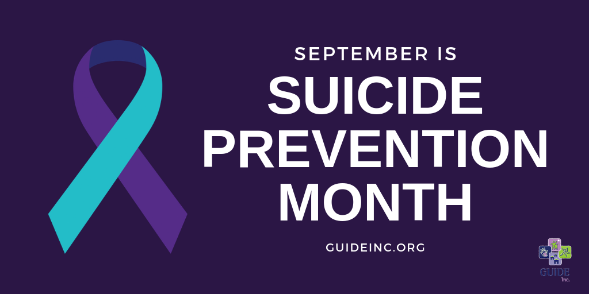

Many people tend to separate the mind from the body. The body is simply a vessel for the mind, and they both have different needs and requirements to function. This makes sense to a degree, however, mental and physical health are intertwined more than commonly thought.

*What is Mental Health?*

The World Health Organization (WHO) defines mental health as “the state of well-being where every individual realizes his or her own potential, manages the normal stresses of life, works productively and fruitfully, and can contribute to her or his community.”

Although mental illness is most often associated with diagnosable disorders, such as bipolar disorder and ADHD, modern literature refers to mental health more so along a continuum. On one end are people who exhibit active resilience and are capable of taking life’s uncertainties in stride. On the other end of the spectrum are individuals whose disorders cause severe impact on daily functioning. This means that if you don’t have any diagnosed disorders, it doesn’t necessarily mean you have a clean bill of health. Gaging mental health is more dependent on holistic factors, such as how well you handle stress.

*What is Physical Health?*

Physical health essentially boils down to nutrition and activity. Getting the right nutrients, minerals, and a good balance of fats, proteins, and carbohydrates is key to maintaining a balanced diet.

Activity is what keeps your body running, however many are not meeting the recommended 60 minutes or more of physical activity each day because of our increasingly sedentary lifestyle due to social media and television.

*How are Mental and Physical Health Connected?*

* Poor physical health can lead to a weakened immune system. Research suggests that the immune system may actually cause depression. Stress (especially chronic stress) triggers an immune response within the brain itself. That inflammatory response may be a driving cause of depression.
* Mental illness is closely linked to fatigue. When someone is chronically depressed or anxious, they are less likely to engage in physical activity or to maintain basic hygiene, leading to vulnerability to disease.
* Many cardiovascular issues and diseases are connected to bouts of anger and anxiety.

*What Can I Do?*

* Try to create and stick to a sleep schedule that ensures you get around 6-8 hours of sleep a night.
* Make time in your daily routine to go outside and do an activity, like a walk or a hike with a friend.
* Try new activities or hobbies that require you to get up and moving, like sports, crafts, etc.