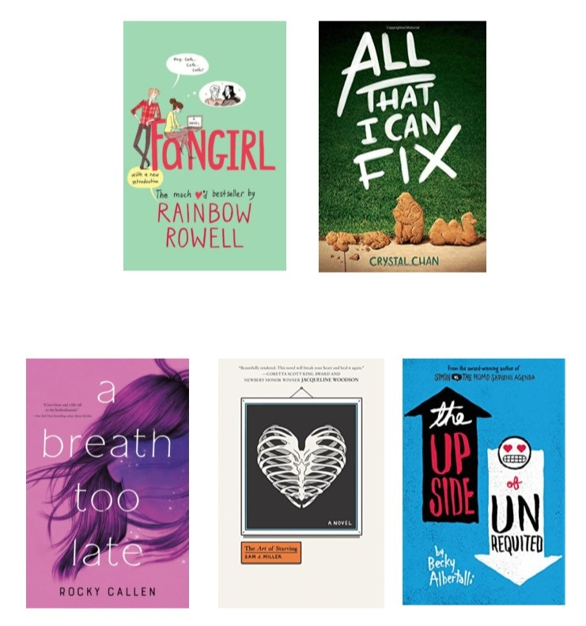

Growing up, I often saw myself in the books I read. Whether it be Percy Jackson or The Fault in our Stars, I saw myself in the characters and found myself along the way. This is why I stand firmly with the idea that it is important for young people to see themselves reflected in the literature that they consume. Below is a short list of YA books reflecting mental health that I enjoyed and I hope you will too!

* The Art of Starving by Sam J. Miller
* Darius the Great Is Not Okay by Adib Khorram
* Fangirl by Rainbow Rowell
* History is All You Left Me by Adam Silvera
* All That I Can Fix by Crystal Chan
* Turtles All the Way Down. by John Green
* A Breath Too Late by Rocky Callen
* The Memory of Light by Francisco X. Stork
* The Upside of Unrequited by Becky Albertalli
* Challenger Deep by Neal Shusterman