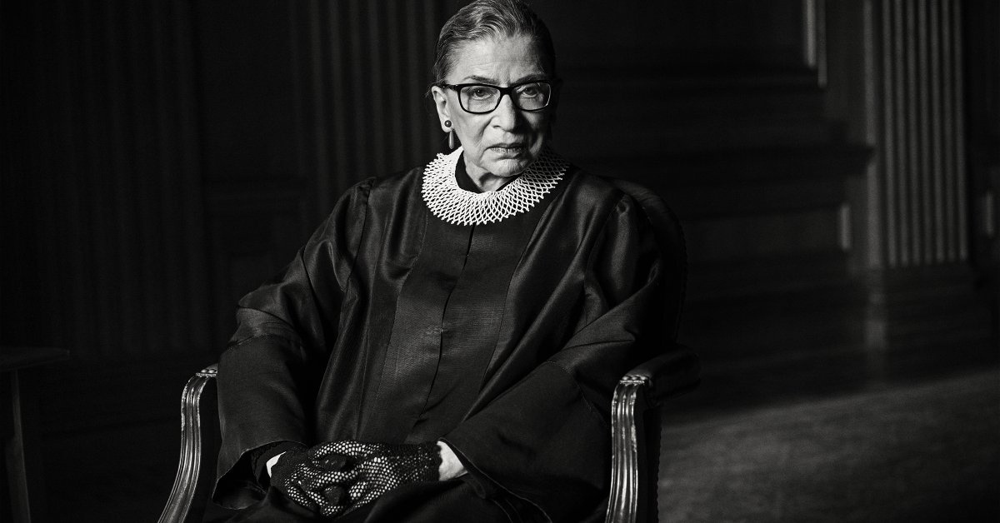

On the evening of Friday, September 18, 2020, Supreme Court Justice Ruth Bader Ginsburg died due to complications of pancreatic cancer. As the oldest of the nine justices, Ginsburg has survived cancer 5 times since 1999. But through all of this, she continued working to the fullest extent, never letting her health problems get in the way of serving our country. She has spent her whole life pushing past adversity to fight for equality and justice.

At age 17, Ginsburg attended Cornell University on a full scholarship and graduated with a bachelor’s degree in government, the highest ranking female in her class. Though she scored highly on the civil service exam, due to her pregnancy, she was only offered a job as a typist in the Oklahoma Social Security Office. Two years later, as one of 9 women in the 500 person class of Harvard Law School, she faced more discrimination, asked by the dean why she was taking a spot that “should go to a man”. During all of this, her husband, Martin Ginsburg, contracted cancer. On top of her own law studies, she had to help Martin keep up with his classes while taking care of both him and their daughter. Still, she was able to persevere through this, and became the first female member of the Harvard Law Review. After transferring to Columbia Law, she was elected to the Columbia Law Review, and graduated first in her class in 1959.

Although she graduated with an elite law degree, being a woman, she still couldn’t find work at law firms or as a clerk.

It wasn’t until her mentor and law professor threatened to bar his students from clerking with Judge Edmund Palmieri that Ginsburg was offered a clerkship. A few years later, she landed a teaching job at Rutgers University, where she was paid less than her male colleagues, and had to hide her pregnancy to avoid being fired. But her time at Rutgers started her on the path to fighting for equality, when the ACLU began referring gender discrimination cases to her. She began to teach about gender discrimination, and in 1970 co-founded the first law journal in the US that focused exclusively on women’s rights.

From 1972 until 1980, Ginsburg continued to fight against gender discrimination as general counsel of the Women’s Rights Project at the ACLU and as the first tenured woman at Columbia Law. Rather than focusing on immediate and complete equality, she opted to break down specific discrimination statutes one at a time. Between 1973 and 1976, she won 5 out of 6 gender discrimination cases she argued before the Supreme Court. In 1980, she was appointed to the US Court of Appeals, where she remained until ascending to the Supreme Court in 1993.

As an Associate Justice, Ginsburg maintained the work she had been doing her whole life. In 1996, she authored the majority opinion in a ruling which struck down the Virginia Military Institute’s male-only admissions policy. In 2007, she dissented with the majority opinion in a pay discrimination case, inspiring a 2009 law that made it easier for employees to win pay discrimination claims. She has consistently supported abortion rights and worked to strike down laws that baselessly restrict access to abortion services and birth control. She was a leader in the fight to ensure equal voting rights for everyone.

Earlier this year, Ginsburg said she “would remain a member of the court as long as [she] can do the job full steam”, displaying the perseverance she internalized her whole life. When her mother died right before her high school graduation, or when she was in the hospital for cancer treatment, or when her husband died from cancer, she did not miss a beat in continuing her work. Right up until her death, she was still planning on partaking in the October oral arguments. As the ideological battle for the Supreme Court heats up once again, it is easy to agree that Ruth Bader Ginsburg is a titan of American history and equal rights, and is an inspiration to us all.