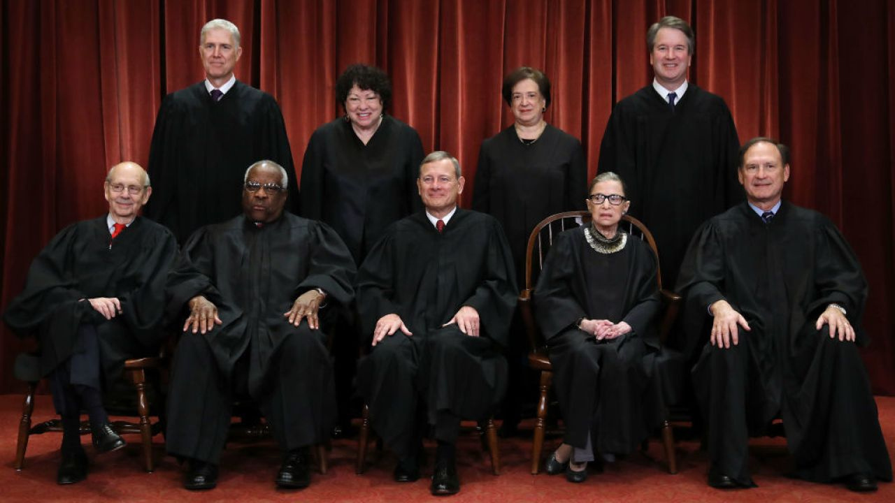

This previous week, the well-known and influential Ruth Bader Ginsburg passed away at the age of 87 years old. A monumental figure through her work in our judicial system, she had a large influence on many of our laws, that influence only growing when she became a justice on the Supreme Court of the United States. The SCOTUS positions are nominated by the president and confirmed by the Senate through a lengthy process evaluating an individual’s ability to be impartial in such an important position. However, with the death of Ruth Bader Ginsburg, many are wondering what will happen to the seat she has left. In 2016 under President Obama, the precedent was set that a SCOTUS position could not be filled by the sitting president during an election year, instead a responsibility for the winner of the upcoming election.

In the case of President Obama, the seat of Antonin Scalia was empty 9 months before the election, though the Senate did not approve the nomination. However, currently, President Trump is planning to put forward a nomination to fill the SCOTUS position, despite there being 45 days until the election. As well as that, many legislators that were against the nomination in 2016 are currently voicing their support for President Trump’s potential nominee, though many constituents believe it to be hypocritical to do so.

The situation was further complicated with the news that Ginsburg had told her daughter that she did not want her seat filled under the current president only 4 days before her death. With the new SCOTUS pick likely having an influential position in decisions regarding abortion, healthcare, and more, many see this as a partisan issue. The issue regarding SCOTUS has even prompted some to question the current system of nominations and approval, not believing that it passes through all the steps of checks-and-balances that many believe is the backbone of our country. Regardless of the outcome of the current situation, regardless of political belief, we can all agree that the loss of Justice Ruth Bader Ginsburg is a devastating loss to everyone whose lives she impacted and beyond.

