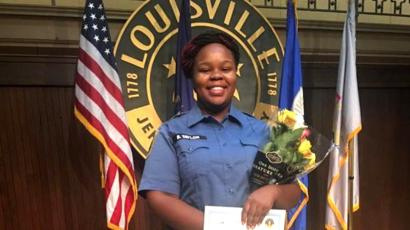

On March 13 in Louisville, Kentucky, Breonna Taylor was shot and killed in her own home by officers on a narcotics investigation. For months, people protested her murder and countless other unjust deaths of black people by the hands of police. Breonna’s family’s lawyers demanded at least manslaughter charges against her killers, and even Beyonce demanded that the Kentucky attorney general brought justice, but Brett Hankinson, one of the three, was only fired by the Louisville Metro Police Department.

Just last Wednesday, Hankinson was charged with three counts of first degree wanton endangerment, a class D felony where someone undeliberately behaves in a way that could endanger others. In this case, the “others” didn’t refer to Breonna Taylor—it referred to her three neighbors whose walls were shot by Hankinson. Allegedly, none of the 10 shots he fired hit Breonna.

Just hours after this officer’s indictment was announced, people returned to the streets of Louisville to protest. During these protests, two Louisville officers were shot and a suspect is currently in custody.