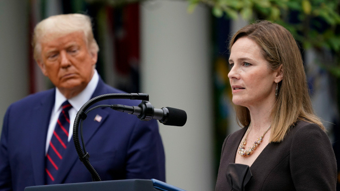

Yesterday, Donald Trump confirmed his nomination of Amy Coney Barrett to take the late Ruth Bader Ginsburg's seat on the Supreme Court. With only 37 days until the election on November 3rd, Senate Republicans begin an intense sprint to install Judge Barrett on the court. Senate Majority Leader Mitch McConnell currently has the support of Republicans to move forward with the confirmation process. Over the objections of outraged Democrats, Republicans are plotting one of the fastest Supreme Court confirmation processes in history- set to play out in a little over half the time needed to simply select a nominee. To achieve this, they plan to hold four days of nationally televised hearings on the week of October 12, aiming for a vote for Barrett's confirmation on the Senate floor just mere days away from the presidential election.

Barrett herself is a conservative appellate judge and a law professor at Notre Dame University. Additionally being a former law clerk to the late Antonin Scalia, a strongly right-wing beacon, Barrett further cements herself as greatly conservative. Far-right advocates zealously backed her nomination due to her writings on religion and the law, and many critics suggest that Barrett's religious views would influence her rulings.

Regardless of her erring on the side of caution since joining the appellate bench, Barrett has numerously and consistently demonstrated her conservative values on the Second Amendment, immigration, and abortion.

Last year, Barrett was the sole judge who dissented when a 7th Circuit panel majority rejected a Second Amendment challenge from a man found guilty of mail fraud and was subsequently prohibited from possessing a firearm under federal and Wisconsin law, writing that "Legislatures have the power to prohibit dangerous people from possessing guns, but did not strip felons of the right to bear arms simply because of their status as felons."

More recently, Barrett dissented a district court decision temporarily blocking a Trump policy that disadvantaged green card applicants who apply for any public assistance. In dispute were federal immigration regulations regarding when an applicant would be deemed ineligible for permanent status in the US. She wrote that the Trump administration's interpretation of the "public charge law" law wasn’t "unreasonable," leading critics to state that her construction failed to take account of the immigrants who would "bear the brunt of the" new rule.

Although McConnell didn't publicly confirm being committed to a pre-election vote due to the compressed timeline, his confidence increased with the near-unanimous monolithic support of Republicans. With the possibility of a 6-3 conservative majority in reach- which has the potential to reshape abortion rights, immigration law, and much more, Republicans quickly united in strong support of Barrett. President Trump himself stated, during an interview on “Fox & Friends Weekend," that it's entirely "possible" for Barrett to tip the court against the Roe v. Wade decision.

Democratic leaders and critics remain vocal and strong in their dissent against Barrett's nomination. Senator Chuck Schumer of New York told reporters that “A vote for Amy Coney Barrett is a dagger aimed at the heart of the health care protections Americans so desperately need and want,” and Senator Tammy Duckworth wrote that "The deadly COVID-19 pandemic has killed more than 200,000 Americans in a matter of months. Yet, instead of addressing the many life-and-death issues facing working families during COVID19, Trump and the Senate Republicans are focused on jamming through this nomination in a transparent grab for power so they can achieve their long-sought goal of repealing the Affordable Care Act and ripping away healthcare from millions."