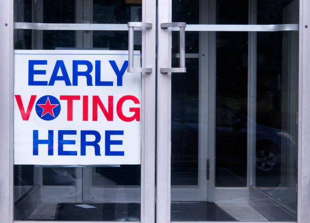

As early voting goes into full swing, states have seen a huge turnout. In Texas alone, 2.63 million voters have already voted, either in person or by mail. To put this in context, this is more than 15 percent of registered voters in the state. This is still more impressive when considering the multitude of issues that early voters have faced. The long lines to simply be able to cast the ballot have caused waits as long as eight hours and technological difficulties at a variety of voting stations have caused voting to be a challenge.

While the unexpectedly high voter turnout and the pandemic could possibly excuse these difficulties, it seems that these problems could be a cover for a more sinister issue within the voting system. For example, Georgia, a state with historical voter discrimination, has seen a significant reduction of polling places “across racial lines”. This has caused a disproportionately high wait time in predominantly minority areas (a wait time of 51 minutes) in comparison to predominately white areas (a wait time of only 6 minutes). In addition, a 2006 state law allowing only one early voting station per county has been cited as a cause for the long voting lines. This caused issues in states like Ohio where small communities like Vinton County, a primarily Republic county of 135,000 people, have access to the same number of polling sites as the 1.3 million residents of the majority Democratic Franklin County.

David Litt, former President Barack Obama’s speechwriter, has pointed out that this has “made voting far easier for Republicans and far more difficult for Democrats”.

On a more local scale, if you registered to vote, make sure to get out there and vote or send in your mail-in ballot. If you are registered to vote early in Texas, make sure to vote before October 30, 2020. Go to this link for a helpful guide to making sure you have everything you need to successfully vote in person: <a href="https://www.votetexas.gov/faq/early-voting.html">https://www.votetexas.gov/faq/early-voting.html</a>. Go to this link for a guide to voting by mail: <a href="https://www.texastribune.org/2020/08/21/vote-by-mail-texas/">https://www.texastribune.org/2020/08/21/vote-by-mail-texas/</a>.