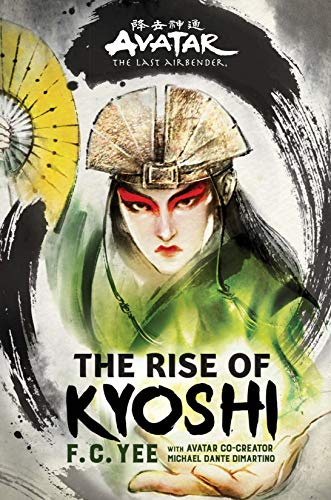

Heads up Avatar: The Last Airbender fans! The Rise of Kyoshi, by F.C. Yee, is the perfect book to read after your binge of the show and subsequent question of what you should do with your life now. The first book in a duo, The Rise of Kyoshi details the story of our favorite murderous avatar, Kyoshi, and the unique struggles she faced throughout her avatarhood. This book challenges a lot of the ideas we have about the Avatar universe and tells an incredible story about a character that we only know a little about. Kyoshi’s story was definitely unique, as with every avatar, and her story will leave you hanging on to her every word. This book is a great read for ATLA and TLOK fans, anyone who loves reading about LGBTQ+ romances, and anyone that would love to see Kyoshi kick the butt of whoever she encounters.