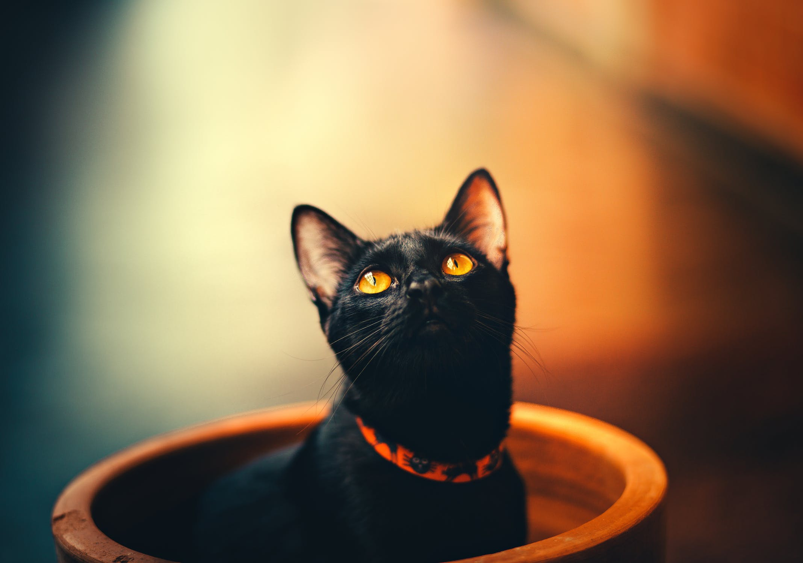

We associate Halloween with many iconic things: bright orange pumpkins, garishly sweet candy corn, and black cats in witch hats. While these may seem like innocent fun (and they are for the most part), the ageold tradition of associating black cats with the occult has long-lasting conditions today. Black cats were first branded as “dangerous” in the Middle Ages when it was believed that witches could morph into them. This means that when a witch was burned at the stake, more often than not, a black cat would be burned too. In addition, other cultures would often participate in these supernatural rituals that involved the sacrifice of black cats. This way, slowly but surely, black cats became inextricable from the world of evil.

This problem manifests in a multitude of ways today, but the most prominent one is their low adoption rates. Due to these heinous associations, black cats have the lowest adoption rate, and the highest euthanasia rate when compared to other cats. Furthermore, black cats have a higher chance of being adopted for ritual sacrifice purposes or just for the aesthetic near Halloween. In fact, these problems got so bad that most shelters do not allow adoptions of black cats at all in October.

So, what can be done to dissuade these harmful notions about black cats and help them find a “forever home”? First, it is important to not play into these ideas of black cats bringing bad luck. In many places, such as in China or Japan, black cats are seen as the bringers of fortune. Even if you don’t believe in superstition, simply treat them as a furry friend and not as an omen of misfortune. Second, consider getting a black cat if you’re looking into a pet. If you are looking for a furry friend to keep you company during quarantine, make sure you don’t overlook a perfectly fine feline just because of some spooky stories. Black cats deserve love, just like all furry creatures.