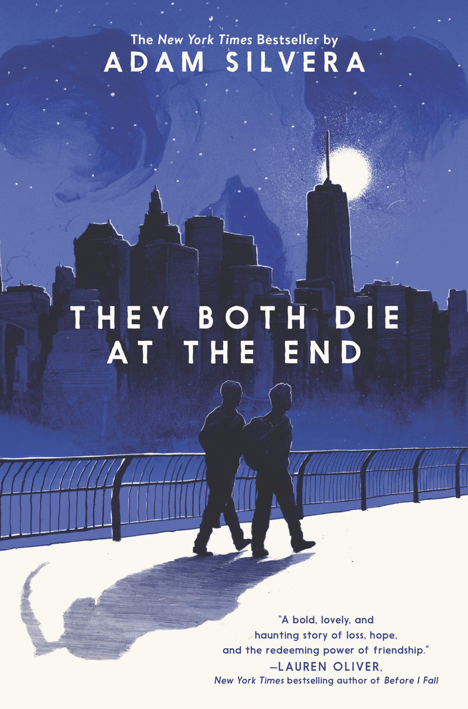

They Both Die At The End, by Adam Silvera, has seemingly the whole book summed up with the title. They both die at the end. But this book has so much more packed inside of it and, despite the candid title, and leaves you hopeful throughout for a twist of fate. It details the stories of 2 boys who get the notification that they will die today with no other information regarding it, a normalized yet feared occurrence. Both boys seek out a “Last Friend,” someone to spend their final day with and find each other. While an unlikely pairing, they encourage each other to do things they’ve never tried before and built a special relationship with each other, despite knowing what the day has in store for them. The explorations of humanity, self, and love throughout They Both Die At The End make it incredibly unique in the best way. This book is incredible and will leave you shocked, crying, and probably shocked despite the book title revealing the ending. They Both Die At The End is a must-read for anyone who is looking for a good story (with LGBTQ+ representation!) that will probably leave you as an emotional wreck once you turn the last page.