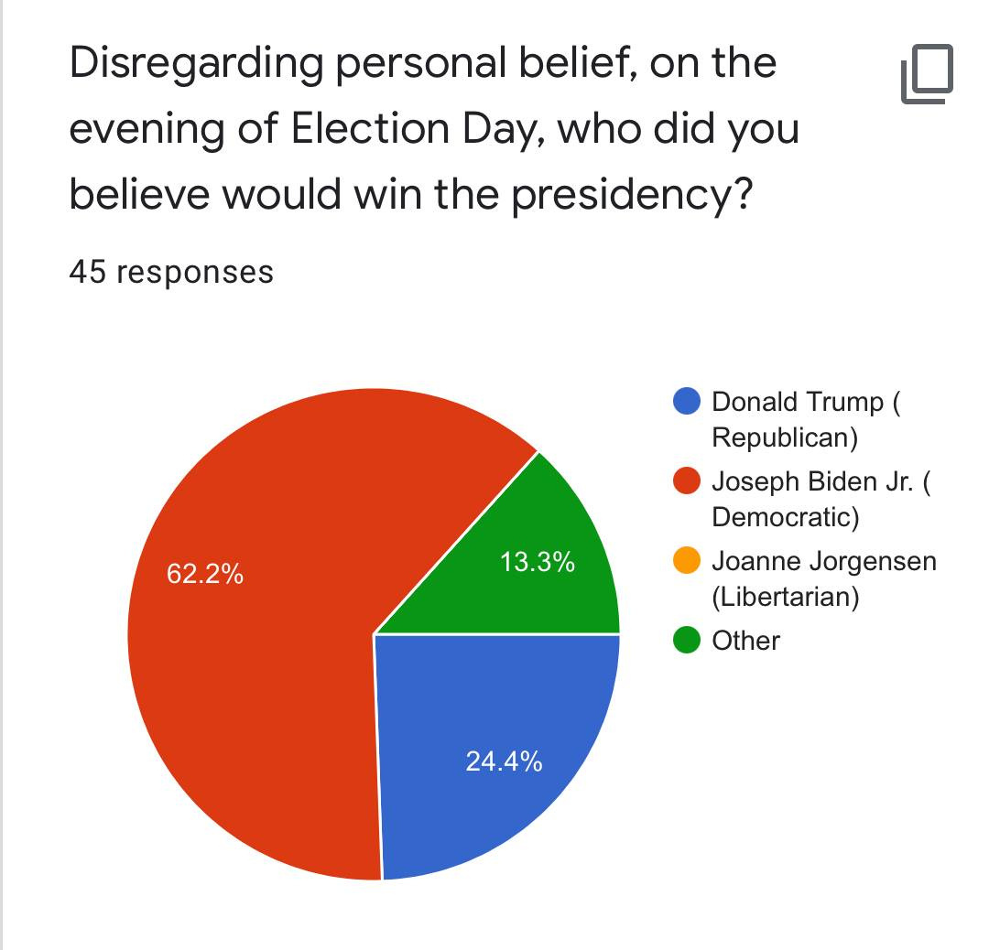

As the final results of the US 2020 Election come streaming in, one thing is apparent: the polls (kind of) got it right this time. However, what are polls? More specifically, how do they predict the outcome of elections? And, perhaps most importantly, how do they get it wrong?

Polling is a method of generating data that can predict the general opinion of a much larger population. For example, in the United States, the interrogation of over 120 million voters regarding their opinions on the current state of the election is completely impractical. For that reason, polling takes only a small percentage of the population (approximately 1,000-1,200 adults or registered voters in the United States) and extrapolate that data for the entire nation. This, of course, can be applied to smaller scales for polls covering smaller numbers of people. For example, the poll at the top of this page shows a poll that represents all TAMS students. Not everyone took the poll (only 45 students, about ~8 percent of the TAMS student body), however that percentage is large enough that, statistically, the poll can represent all TAMS students.

Although polling can be a highly influential tool that can gauge the opinion of a large populus, numerous criteria have to be fulfilled in order to correctly gauge the opinion of the population being studied. One major requirement of polling is that the selected sample has to be representative of the general population. Taking the TAMS poll as an example, I would not have posted the poll onto the UNT subreddit r/unt, nor even the TAMS subreddit r/tams, because these places are not composed entirely of current TAMS students. Including these opinions in the poll would not have been representative of the target population (TAMS), because individuals taking the poll would not necessarily be TAMS students. Secondly, the poll has to be a random sample of the population, that is, each individual of a general population has to have an equal chance of getting picked. For example, major pollsters pay phone number generating companies to gather random phone numbers inside the United States to select participants for their poll. This is because, within a degree of error, almost every adult in the United States has a phone number. This is in contrast to, say, a Twitter poll, where one can conclude that not every adult in the United States has a Twitter account.

The reason why it’s important to have a random sample is because this lowers the chance that biases can occur in the poll results. For the sake of the example, let’s say that Twitter users generally have a bias towards one candidate than another. If the poll is focused on the Twitter audience and applied to the general United States, this could paint a misconceived picture on the opinion of the United States based on a nonrepresentative sample of the United States.

Despite the numerous precautions pollsters can take to reduce their chances of inaccuracy, pollsters can simply reach the wrong conclusions about the nation with their data. This is especially apparent in the US 2016 Election, when pollsters gave Hillary Clinton a sizable lead in the polls, only to be disappointed on election night. Although pollsters may have gotten it right this time around, there are still numerous issues with polling that could lead to inaccurate results. One important aspect of polling is that people can say whatever they want. This, of course, can lead to polling subjects simply lying about their opinions. Perhaps the most influential factor about polling that’s especially evident in the divided political climate of today is the social desirability bias, where polling subjects intentionally provide inaccurate answers to polling questions in order to be viewed favorably by others.

In order to avoid judgement by others in their social circle, polled individuals may provide inaccurate responses to questions if their true beliefs may throw them in a negative light. That’s why it’s important to provide anonymity to polled individuals- anonymous subjects feel less likely to bend to social pressure.

Although pollsters aren’t correct all the time, polling serves as a simple way to gauge the opinion of a large population with a relatively small sample size. Despite the numerous instances throughout political history where the polls were wrong, polling continues to be a preferential model to gauge the opinion of a large group of people, and serves as a (relatively) accurate way to gauge the response to any political action.