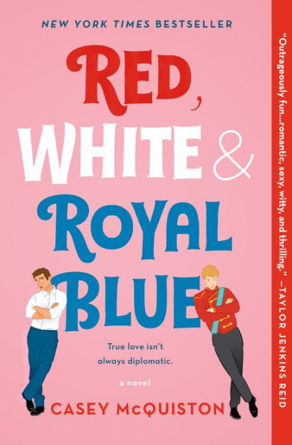

Hey book readers, book list-compilers, and anyone that hasn't read a book in at least 4 years but is slowly trying to get back into it! This week I read Red, White, and Royal Blue, which was perfectly fitting for the topic of the election. Anyone that has talked to me in the past 5 days knows that this has become one f my favorite books of all time, and for good reason. Red, White, and Royal Blue, by Casey McQuiston, is an absolutely hilarious yet meaningful story about the son of the President of the USA, who finds himself in a hysterical situation when he is confronted with his deep hatred for the young Prince of England, which turns into something else entirely - an unlikely romance story. This book had me laughing the whole time, wishing my parents ran for president, and definitely caused some tears at some of the more emotional parts. As well as the incredible plot, the story takes place during the 2020 election and is incredibly relevant in our current political climate (I am still currently in shock at how it almost predicted our recent election perfectly, despite being published in early 2019). All of the characters we meet in Red, White, and Royal Blue are hilariously relatable for any teenagers or young adults that grew up during the insanity that is recent US politics, and you will find yourself rooting for the most unlikely of characters. This has become one of my favorite books, and if anyone decides to read it, please know you have a whole community of people that have fallen in love with the book as well.