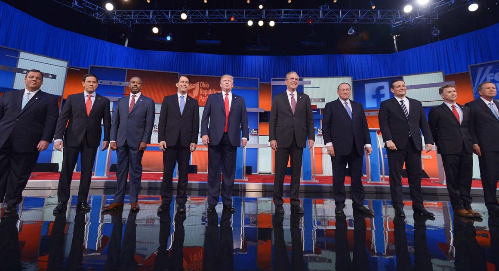

In 2016, Hillary Clinton won by three million votes but lost by eighty thousand. In the following weeks, many pundits were quick to blame her loss on the electoral college, Jill Stein, and Russian interference. While these analyses may explain what happened thoroughly enough, they fail to answer a more pressing question: How did a candidate as unconventional as Donald Trump get so close to the presidency in the first place? The fact is, more and more voters are showing their unhappiness with having to support the “old guard”. I contend that these shifts mean that the 2016 and 2020 elections mark the beginning of a major political realignment in America.

At the time, the 2016 Republican presidential primaries marked the largest presidential primary field in American history, with 17 candidates. From the get-go, Jeb Bush was the favorite to win: he was a moderate, he had political experience, and he was an effective fundraiser. However, he faced significant opposition from other members of his party. Both Donald Trump and Ted Cruz used their campaigns to portray themselves as “outsider candidates”: Cruz said that Republican voters wanted an antiestablishment nominee. Trump promised to “drain the swamp”. Ultimately, it was this narrative that prevailed. As we all know, Donald Trump won at the Republican National Convention with 1,441 delegates, ultimately becoming the 45th President of the United States. Ted Cruz finished second, with 551 delegates.

Many of us know about Bernie Sanders, who ran a campaign based on social democracy and agitating for political revolution. In both of the presidential campaigns he ran, he ultimately finished in second place. Does this spell the end for left-wing populism? Not at all. In fact, we can look at down-ballot races and organizational growth to realize that left-wing movements are growing. Out of the 29 candidates that the Democratic Socialists of America (DSA) endorsed, 20 won their seats—including Alexandria OcasioCortez, Rashida Tlaib, Cori Bush, and Jamaal Bowman, meaning that the DSA now holds four seats in the House of Representatives. There are now democratic socialist caucuses in 15 state legislatures, and DSA membership has been growing precipitously: in September 2018, membership was 50,000 strong. Two years later, that number’s swelled up to 75,000.

Do these developments mean that politics has been radically transformed forever? Not necessarily. Joe Biden won the presidency after 47 years in office, and the Lincoln Project, made up of mostly establishment conservatives, has shown a willingness to fight for the mantle of the Republican Party. However, voters are growing more and more supportive of populist messaging, and it would be foolish for party leadership on both sides to ignore this trend.