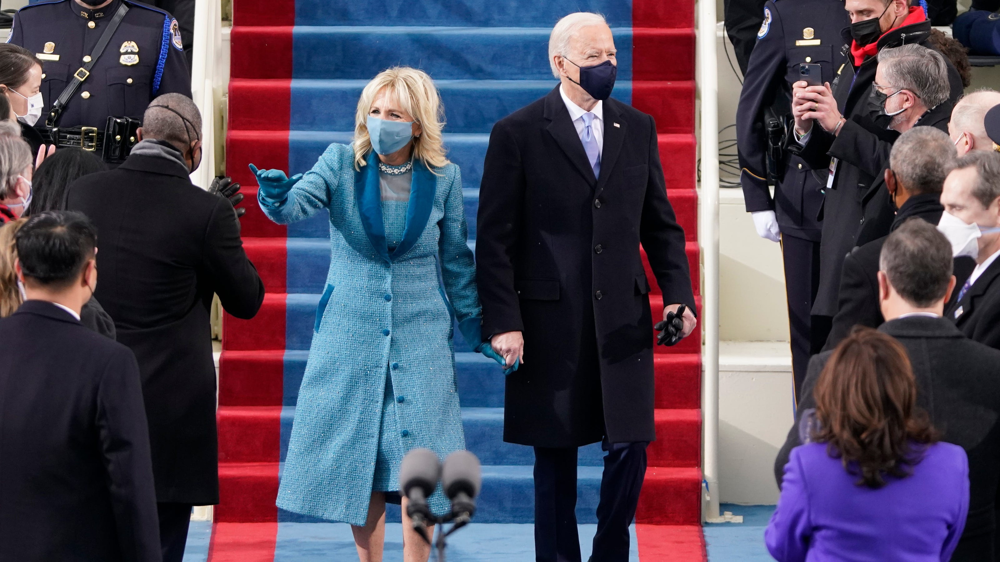

This recent Wednesday, January 20th, was historic in a number of ways. Most notably, it marked the inauguration of now-President Joe Biden. The transition between former President Trump and President Biden was a rocky one in many ways, beginning with the refusal to accept election results to former President Trump refusing to attend President Biden's inauguration ceremony. This choice led to many changes in the ceremony, ranging from the skipping of the historic walk through of the White House between the First Ladies as well as the passing of the 'nuclear football' by proxy, rather than in-person, as it has been done in previous inaugurations.

There were many security concerns regarding the inauguration process, especially after the recent attacks on the Capitol that took place on January 6th, 2021, and led to 5 deaths and a complete lockdown of the Capitol during the Electoral College vote. In a country still reeling from the impact of the COVID-19 pandemic, the storming of the U.S. Capitol theorized to be supported by the sitting president at the time was just another addition in a long list of unbelievable things that took place in the previous 4 years. Many citizens are reminded that, even with a new president, sudden change is impossible and the sense of civic duty many of us felt the past few years must be continued in order to implement real change. Much is still left up in the air, between the handling of the COVID-19 pandemic under a new president, as well as the looming possibility of an impeachment trial for former President Trump, but regardless the Ballot Board wishes everyone a happy late Inauguration Day.