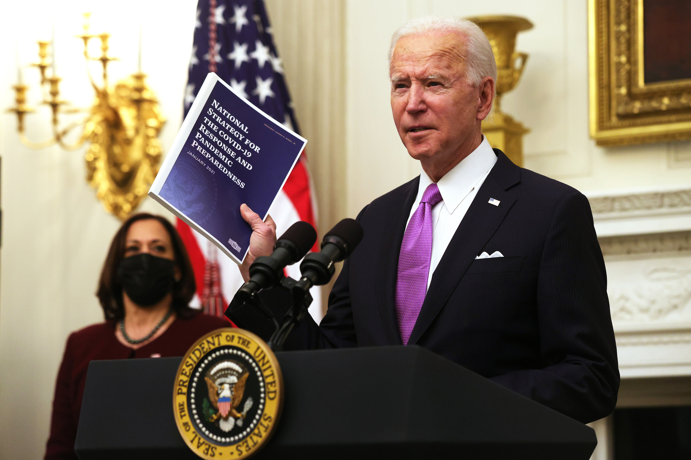

Amidst the backdrop of exponentially increasing COVID-19 infection rates (which has now caused the deaths of around 400,000 Americans) and deepening social inequities, Joe Biden recently took office as the 46th president of the United States. Naturally, these challenges (previously unforeseen for any other administration to this extent) seem to be near-insurmountable hurdles that the Biden Administration needs to effectively deal with.

However, most importantly, these challenges are deeply relevant to all of our lives. This past year has taught us that democracy and health are not far removed, and our past political dysfunction has directly led to the national mishandling of COVID-19. The Biden Administration seeks to resume effective disease control with their plan (linked below) for tackling COVID-19. This plan seeks to realistically accelerate vaccine distribution and disease containment, however, there still needs to be more done to truly manage this public health crisis.

Firstly, before anything, universal mask-wearing and social distancing efforts need to be emphasized and thoroughly implemented through regulation. This will come hand-in-hand with smoother vaccine distribution. There also needs to be a focus on the economic impacts of COVID as well. The health consequences of COVID can largely be attributed to economic disparity over the disease itself, so Biden’s Administration would likely need to increase stimulus packages to support the millions of newly unemployed people. Alongside a focus on restoring economic function (without compromising health), the impact of COVID would be greatly lessened. Finally, Biden would need to overturn years of divisive politics and rhetoric. Racism, poverty, inequity, and systemic marginalization have all been issues at the center of public conversation today, and acknowledging them while elevating their importance and bringing awareness is also deeply connected to the health of our nation. If Biden could return the US to a state where politics brings us together instead of causing divides, that may do more for our nation’s collective health than anything in the past four years.

**Biden’s COVID-19 Plan**: <a href="https://www.whitehouse.gov/priorities/covid-19/">https://www.whitehouse.gov/priorities/covid-19/</a>

