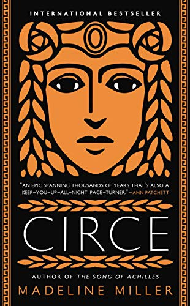

I will admit, I began reading Circe, by Madeline Miller, with some hesitancy. Miller is the author of one of my favorite books (The Song of Achilles), and I worried if her other work would be able to impact me the way that her previous novel had. From the first page of the book, I was pleasantly surprised by what I've deemed 'The Madeline Miller Touch', her incredible talent to trace the reader through the entire life story of characters we've known since childhood, though painting their youths in an incredible different light. Circe caught me off guard at every turn, and I had no idea what to expect as I turned every page. The novel itself is incredible well-written, but the imagery and the way the reader feels as if they are Circe, experiencing her life alongside her, is what quickly made this novel another one of my favorites. For anyone looking to read more adult Greek Mythology, and to redefine the heroes and villains we've known for years, Circe is a 100% recommend.