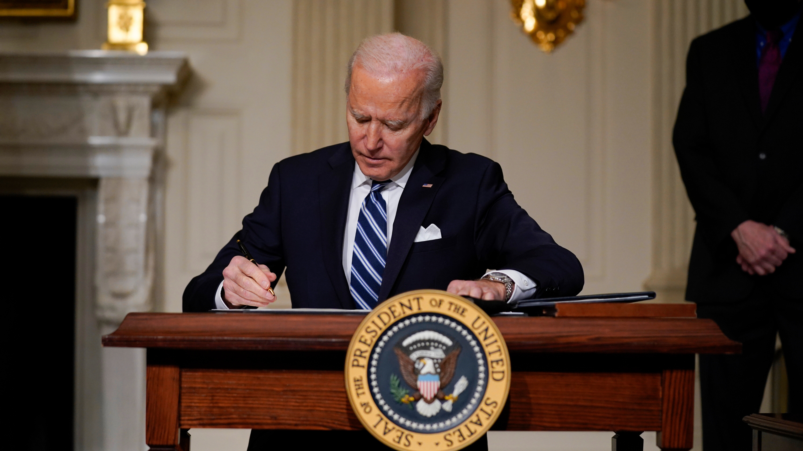
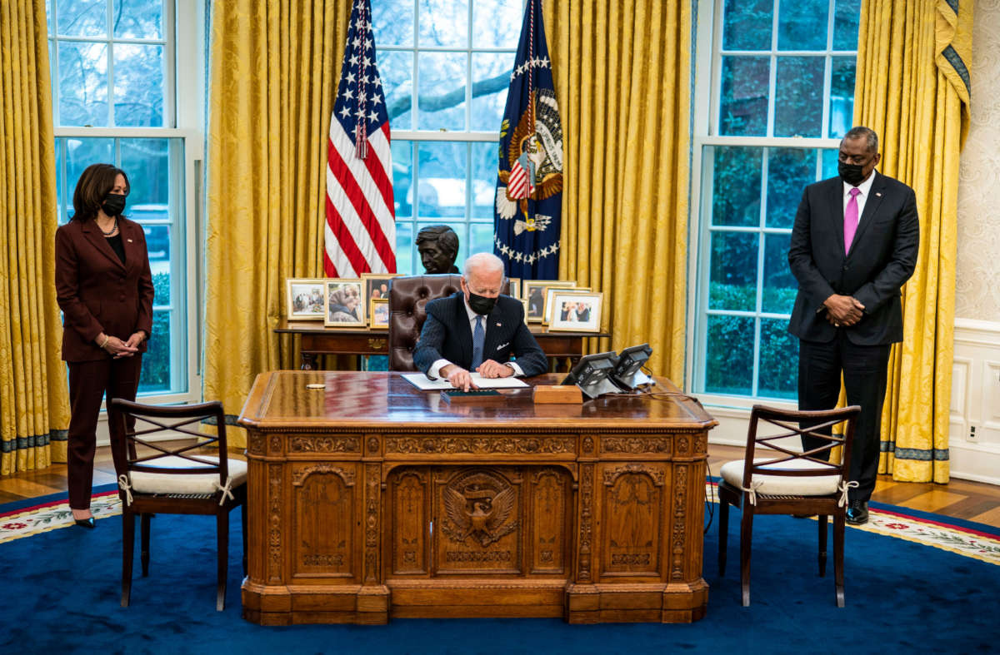

At noon on January 20th, 2021, Joseph Robinette Biden was inaugurated as the 46th president of the United States. After 11 days in office, President Biden has started to put his policy plans into action and given insight on how he plans to spend the next four years. This is an overview of Biden’s presidency so far and an outlook on what will come in the future.

With the Senate preparing for former President Trump’s second impeachment trial, it is near impossible to pass major legislation through Congress without major delays. Much of their spare time has been used for confirmation hearings for cabinet nominations. However, Biden has still been able to implement many of his campaign promises and policies through executive action. In fact, he has signed a record 42 EAs, covering health care, the coronavirus, the economy, the environment, and many other issues of all sizes. Many of these actions included reversing his predecessor’s policies. Here is a summary of some of the more consequential actions:

<b>Mask mandate on federal grounds and interstate travel</b>
 

While it may have seemed like a divisive issue, some form of national mask mandate has been supported by a fairly substantial majority of Americans throughout the pandemic. This executive order, while not requiring masks everywhere, does mandate their use on federal ground and on interstate travel such as planes, trains, buses, ferries, and other forms of public transportation.

<b>Reversing Trump’s ban on transgender Americans in the military</b>
 

This order reverses former President Trump’s ban on transgender people from serving in the military, and was found to have actually decreased military readiness due to a decrease in troop morale and a reduction in the pool of qualified recruits. The military will now return to Obama-era policy of allowing service to recruits solely based on qualification.

<b>Halting new oil and gas permits on federal lands and waters</b>
 

This order implements part of Biden’s promise to finally tackle climate change, and pauses new oil and gas leases on federal grounds for additional review. However, this order does not affect already approved contracts, so much of the drilling in the near future will be unaffected by this change. Still, this indicates that the Biden administration will take a stronger stance on climate change than in previous years.

<b>Extension on the eviction and student loan moratoriums</b>
 

The pandemic has reduced income sources for many Americans, and those who were already low-wage workers have struggled even more just to survive. This order extends the student loan moratorium by eight months and the eviction pause until the end of March, allowing for people who need it to use the money for other things.

<b>Preventing sex- or gender-based discrimination in the workplace</b>
 

This order takes steps to implement Biden’s campaign promises of ensuring equality for all, regardless of sexual or gender identity, by directing government agencies to prohibit such discrimination. This policy will have limited benefits for private workers, but Biden plans to lobby Congress to pass the Equality Act, which will bring more polished legal protections to LGBTQ+ Americans in areas past the workplace.

In the coming months, Biden will have to deal with the many crises facing our nation. And after the Senate completes the impeachment trial, Biden’s task will turn to securing the votes in Congress to actually pass his legislation. And by far the most pressing matter is the American Rescue Plan, Biden’s coronavirus relief plan. This will tackle many of Biden’s campaign proposals, including direct payments of up to $1400, a plan for reopening schools, a $15 minimum wage, and more. He will also continue working towards his goal of administering at least 100 million coronavirus vaccinations within 100 days of his term. In the long term, Biden hopes to improve Obamacare, reform the tax code, pass more wide reaching climate legislation, and much more.

While it is too early to make assumptions about the Biden presidency, the next few months will be a good indicator of how he will govern the nation. He has big plans for his term, and it will soon become clear how much of his vision will become a reality.

