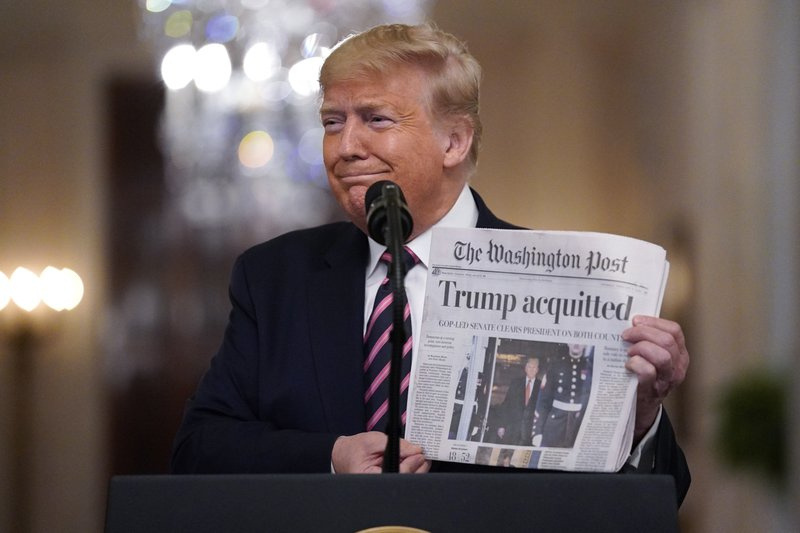

Since the seven Republicans and fifty Democrats who voted for Trump’s impeachment didn’t meet the two-thirds threshold, he has been acquitted a second time. He’s the first president to be impeached by the House twice. Though only seven Republicans voted for Trump’s impeachment, that was the largest number of senators to ever find their own party’s president guilty of an impeachment charge. After his acquittal, he called the trial “yet another phase of the greatest witch hunt in the history of our country.”

House prosecutors had argued that Trump incited the violence at the Capitol on January 6th by pushing false claims about the 2020 election to his followers for a month after the election. Trump’s lawyers countered that nothing he said intended to incite violence. The defense also claimed the House was only prosecuting Trump because of their hatred for him and accused the House of manipulating evidence. A lot of this evidence came from Capitol security footage, showing how close rioters came to members of Congress. Many Republicans voted to acquit, whether it was because they didn’t believe Trump was completely responsible for the attack or because they didn’t believe impeachment was the correct solution. Trump says his movement “has only just begun.”