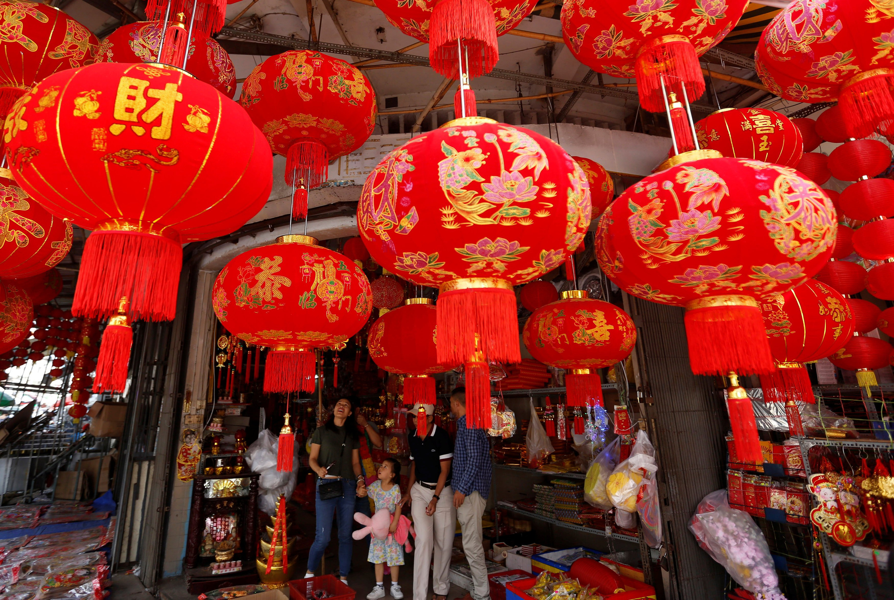

* **Vaccination Updates (USA)**
    + Despite ever-present delays and difficulties, the COVID-19 vaccine rollout is gaining further momentum in the United States. The FDA also approved the addition of four extra doses in each Moderna vaccine vial– potentially increasing the vaccine supply by 20%. Additionally, around 1.66 million people are getting vaccinated per day (well above Biden’s daily target of 1.5 million). Currently, around 38.5 million people received at least one dose. The Biden Administration has secured enough doses to innoculate every American adult, however, many will still not be vaccinated by the end of summer.
* **Lunar New Year travel (China)**
    + As reported by Chinese media, millions of people adhered to government warnings against travel for the Lunar New Year. Typically, hundreds of millions of people travel to visit their families for this festival, however, there was nearly a 70% decrease in travel rates this year. Many Chinese provinces and cities (including Beijing and Shanghai) urged their residents to refrain from travel through work incentives and warnings.
* **Peru with new Health Minister post vaccine scandal (Peru)**
    + Peru recently swore in a new Health Minister after a freshly public accusation of their predecessor using the position to secure a vaccination for a former president. As reported by a Peruvian newspaper, the former president Martin Vizcarra jumped the vaccine line mere weeks before his impeachment. The prior Health Minister was also under fire for her poor handling of the COVID-19 crisis as a whole– allowing a disproportionate amount of cases and deaths for the population of Peru.
* **UK plans global cooperation talks for G7 Summit (UK)**
    + British Prime Minister Boris Johnson recently expressed that he aims to use the virtual G7 Summit next week to call for global cooperation in terms of the “common foe” COVID-19. This summit will also be President Joe Biden’s first major international engagement after his inauguration in January. Johnson aims to discuss cooperative efforts in providing equitable vaccine distribution and mitigating overly nationalistic politics.

