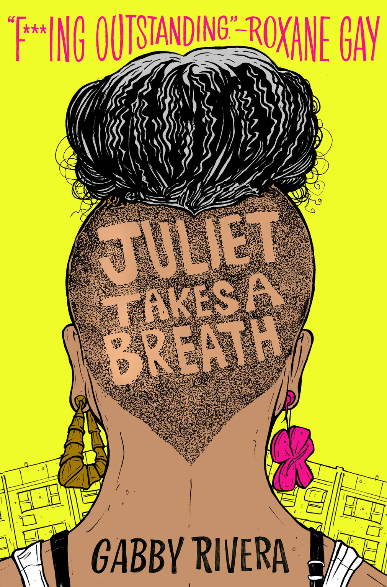

*Juliet Takes a Breath* by Gabby Rivera is a novel that explores Juliet’s journey to better understand herself, her heritage, and her sexuality and how it connects her to the world. Juliet does all this in Portland, where she is interning over the summer for a famous feminist author. At the beginning of the book, Juliet is thrust into the world of the politics of sexuality and gender and, as the book progresses, she starts to establish a place for herself as she begins to understand and even redefine the terms.

As Juliet learns about the world, the reader is given the opportunity to learn alongside her--to be with her as she realizes the importance of intersectionality, the prevalence of trans exclusionary feminism, and the often hidden toxicity of white feminism. Furthermore, it is important to confront these issues because many of them are still as relevant as they are in the book.

Whether you want to read a queer coming of age story or a simple introduction to feminist theory, *Juliet Takes a Breath* is an amazingly written novel that encapsulates the experience of the inherently political experience of growing up queer.