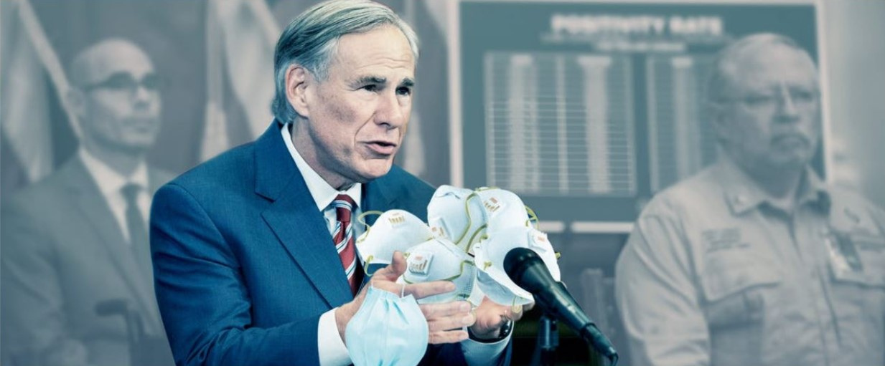

Last week, Greg Abbott announced he would be ending the statewide mask mandate this Wednesday. He stated that it's time for business in Texas to open 100% and this includes restaurants, sporting events, and concerts. As of a week ago, less than 7% of Texans have been vaccinated, and Abbott hasn't said something about vaccine distribution accelerating.

In response to the removal of the mask mandate, in general, businesses in Texas are keeping their mask-wearing rules. Wal-Mart and Costco will continue to require masks for employees and customers, and H-E-B will only strongly encourage customers to wear masks in the store.

Local health experts have encouraged the public to keep wearing masks and social distancing. It's estimated that to reach herd immunity, 75 - 90% of the Texas population will need to be vaccinated. Vaccines have yet to be approved for children under 16, who make up 23% of the population, so continuing to wear a mask is highly recommended.
