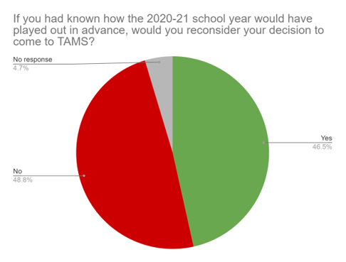
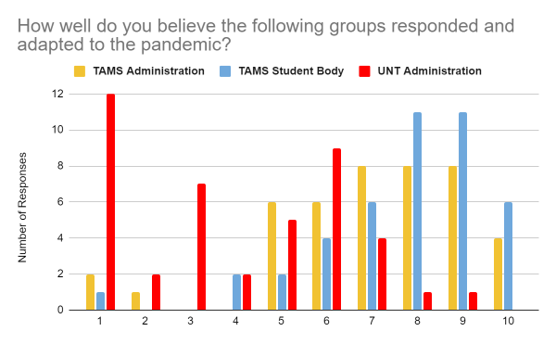

A while back, I was talking with some folks about the infamous town hall regarding the TAMS spring semester. I asked, “we were mad about the decision then, but how do we feel nearly four months later?” After conducting a straw poll with 43 respondents, the answer’s clear: students believe that we should have been treated with more respect and understanding.

I asked respondents to rate the performance of the TAMS student body, TAMS administration, and UNT administration on a scale of 1-10. The TAMS student body and administration received average ratings of 7.72 and 7.02, respectively, which was reflected in students’ responses: most recognized that both groups did the best with the few resources they had access to, though some felt that the TAMS administration had a limited presence this year, unfortunately. When it came to the UNT administration, however, respondents felt more negatively. They gave the UNT administration an average rating of 3.93, giving harsh explanations for their ratings. They disagreed with the University’s assessment that housing TAMS students was riskier than housing traditional university students, and were especially unhappy with the lack of student-parent input involved in making the decision.

In addition, I asked: “If you had known how the 2020-21 school year would have played out in advance, would you reconsider your decision to come to TAMS?” A plurality of respondents said no, they would not have reconsidered their decision. However, it was a slim plurality: 21 students said no compared to the 20 who said yes. Those respondents who said yes all cited similar reasons: lack of engagement, mental health concerns, and difficulty socializing.

Going into Fall 2021, it’s obvious that students want changes to the way things are done. We want UNT to pay more attention to the concerns faced by TAMS, as well as increased engagement to make up for this disappointing year. More importantly, we want genuine, open dialogue concerning the administration of our final years in high school—agreeing to disagree won’t cut it.

