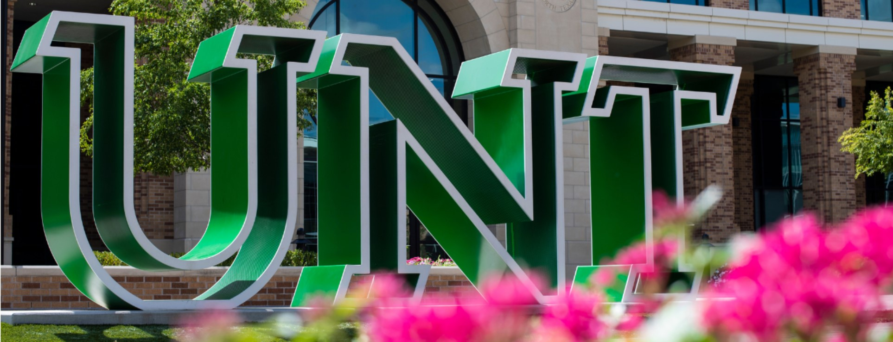

On March 4, 2021, when the COVID-19 pandemic looked like it was coming to an end thanks to the prospect of widespread vaccination, UNT President Neal Smatresk released an official notice promising a rapid return to normal for the university. “I am confident that our Mean Green Family can look to the Fall 2021 semester with renewed hope and optimism and begin planning a robust in-person campus experience,” he wrote. “Much work is underway to prepare us as we move toward a successful fall.” Unfortunately, the spread of the new Delta variant threatens to reverse any gains we might have made since the spring. As the situation changes from week to week, UNT’s response has been woefully lacking, and their communications have revealed that the administration remains unprepared for a surge in COVID-19 cases.

Notably, the university has not issued an indoors mask mandate. Despite evidence indicating that mask-wearing slows the spread of respiratory diseases and guidance from the CDC recommending that those in areas with high rates of community transmission, such as Denton County, wear masks indoors, the most UNT has done is issue an indoor mask “recommendation”. According to the UNT System COVID-19 Information website, this decision was made as a result of Executive Order GA-28, issued by Governor Greg Abbott’s (R-TX), which prohibits government entities from mandating masks. However, there is a precedent for government entities ignoring the executive order. According to public health guidance issued by the Texas Education Agency on September 2, “mask provisions of GA-38 are not being enforced as the result of ongoing litigation”. In other words, the TEA is not enforcing the governor’s ban on mask mandates. Similarly, the Denton City Council passed a mask mandate for businesses, schools, and city buildings which went into effect on August 13. These exceptions all suggest that the UNT administration could do the same if they wanted to. 

Further statements from university officials suggest that the few measures taken by UNT aren’t being administered effectively enough to help mitigate or even track the spread of COVID-19. On September 8, Vice President for Student Affairs Dr. Elizabeth With spoke before the UNT SGA Student Senate to deliver an update on UNT’s pandemic response. She informed us that President Neal Smatresk extended the mandatory testing deadline from September 10 to September 20, explaining that the decision was made because only ⅓ of the student body complied with the documentation requirements. During questioning, it became clear that many students were completely unaware of the requirements in the first place. Later that night, when I questioned Dr. With about the university’s policy of not providing COVID-19-positive students with a place to quarantine, she told me that there were options for those students who were unable to return home. However, she wasn’t immediately forthcoming with what those options were. In fact, when I met the previous week with Director of Housing James Fairchild, he explained that his department wasn’t given enough resources to put people in empty dorms or hotel rooms. For a university with an enrollment of over forty thousand students, Housing has 13 hotel rooms for students who can’t return to their homes.

As we begin our long-awaited return to normal, it’s imperative that those in power realize that prematurely hastening that return will only lead to catastrophe. If we want to feel safe and secure as we attend in-person schooling during a year riddled with uncertainty, our university administration must do more.

