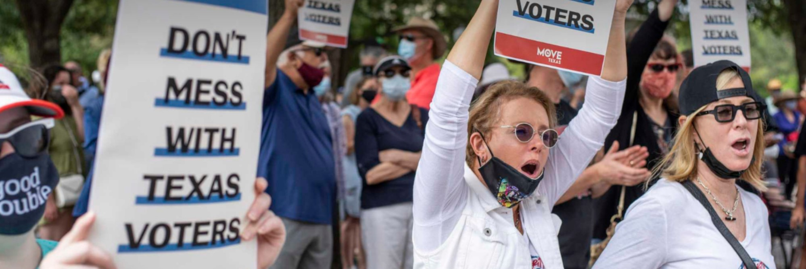

*This legislation is profoundly dangerous and the reason is it suppresses millions of votes by allowing millions of people to vote illegally. That is the intended effect, and that would be the actual effect of this bill. It dilutes the legal votes of American citizens*

*-Ted Cruz over S1, THE FOR THE PEOPLE ACT OF 2021: DIVISION A – VOTING*

Is Texas undemocratic? Our state, undeniably, has one of the strongest political cultures in the nation. As Texas residents, it’s common to hear complex phrases like “traditionalism” and “individualism”, but what do these words mean? Why is Texas so radical when it comes to voting laws? Where did our culture root and how does it still apply towards the modern political climate? All of these questions lie at the roots of the United States’s foundation.

It’s a common fact that the South excels when it comes to agriculture. The land is more fertile and the weather more manageable. In the early stages of the United States, the region was used as an agricultural machine, exporting all of its raw goods to the North for manufacturing purposes. With a large reliance on agriculture came an equal reliance on enslaved peoples for labor. Slavery was important for the South so, in turn, the South was reliant on the government to maintain the status quo. 

Political scientist and expert on state political culture Daniel Elazar, coined this ideology as a “traditionalist mindset.” Traditionalists are similar to individualists, as both express the importance of individuality, yet traditionalism relies on economic success from slavery rather than from businesses or manufacturing. They believed only “elites” should maintain positions of power and that the government should play a role in upholding this system. This leads Texas culture to associate elitism with voting, thus creating more barriers to voting eligibility. U.S. Senator Ted Cruz’s statement is an apt example of this elitism in action. Cruz sees the increase in voting rights as a threat to disenfranchise those in power. 

The question remains - how does this affect voter participation? Surprisingly, the severity of state traditionalism is inversely proportional to eligible voter participation. Texas has one of the lowest voter participation rates in the nation, with eligible voter participation at only 60.42%. On the contrary, Minnesota, a state with a completely different political culture has a 79.96% eligible voter participation rate. 

This mindset isn’t just adopted by Cruz. The list of Texas politicians, democratic and republican, who believe in traditionalist values is almost endless. Traditionalism is poisoning the vital organs of democracy, and we are in dire need to adapt to a more modern and logical state view.

